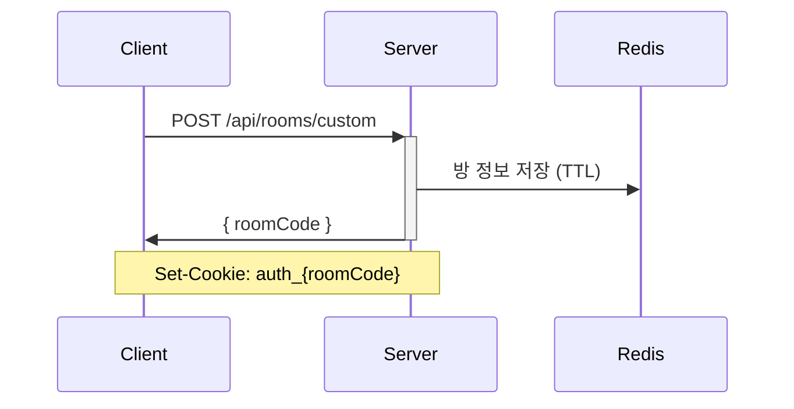
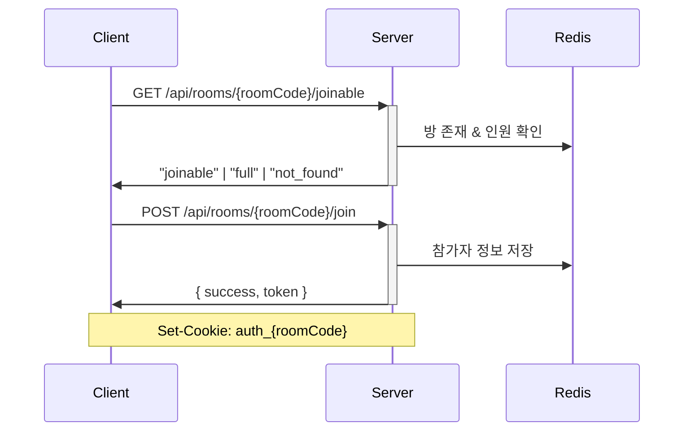
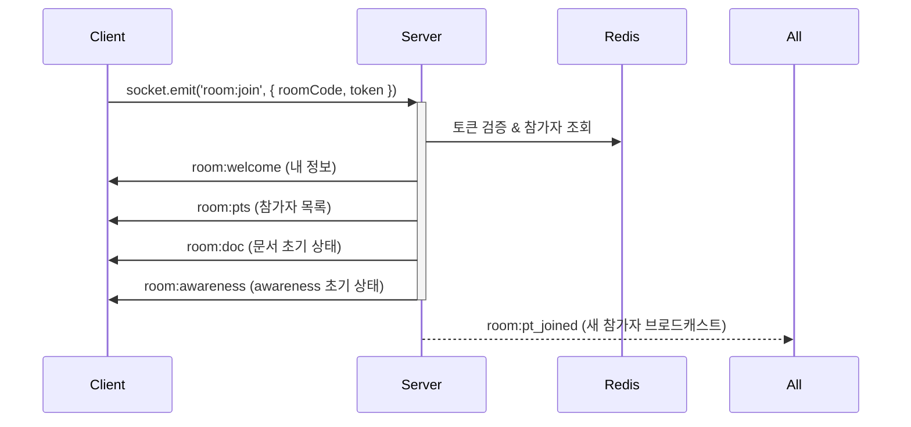
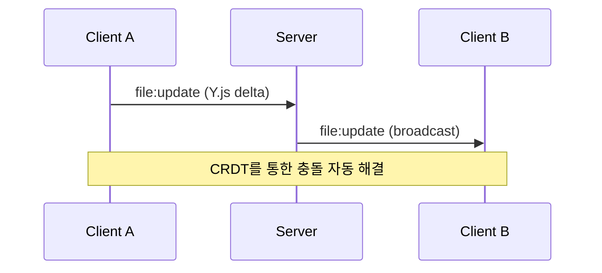
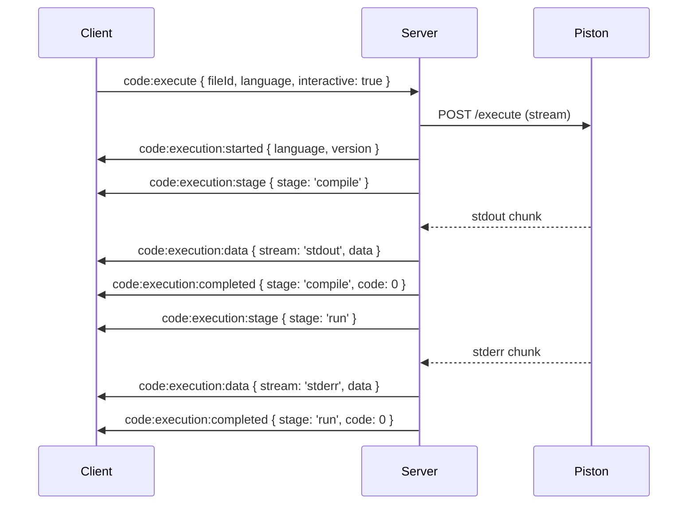
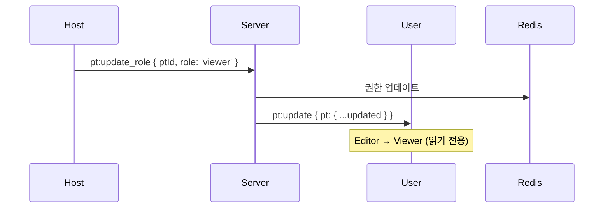

# 📚 API 및 소켓 이벤트 명세

실시간 협업 코드 에디터 프로젝트의 전체 API 및 소켓 이벤트 명세서입니다.

:::info 이벤트 방향 안내

- ⬆️ **C → S**: 클라이언트가 서버로 송신 (Request/Emit)
- ⬇️ **S → C**: 서버가 클라이언트로 송신 (Response/Broadcast)
- 🔁 **C ↔ S**: 양방향 통신
  :::

## 📖 목차

- [API 명세](#-api-명세)
- [Socket Events 명세](#-socket-events-명세)
- [아키텍처 개요](#️-아키텍처-개요)
- [인증 흐름](#-인증-흐름)
- [실시간 협업 흐름](#-실시간-협업-흐름)

---

## 🌐 API 명세

REST API를 통한 HTTP 요청/응답 통신

### 방 관리 (6 endpoints)

| Method | Endpoint                           | Description            | Rate Limit |
| ------ | ---------------------------------- | ---------------------- | ---------- |
| `GET`  | `/api/rooms/:roomCode/joinable`    | 방 입장 가능 여부 확인 | -          |
| `POST` | `/api/rooms/quick`                 | 빠른 방 생성 (임시 방) | 60s / 2회  |
| `POST` | `/api/rooms/custom`                | 커스텀 방 생성         | 60s / 2회  |
| `POST` | `/api/rooms/:roomCode/join`        | 방 입장 (사용자 생성)  | -          |
| `POST` | `/api/rooms/:roomCode/verify`      | 방 비밀번호 검증       | -          |
| `GET`  | `/api/rooms/:roomCode/auth-status` | 인증 상태 확인         | -          |

**📄 상세 문서:** [Room API](./rest/room-api)

### 서버 상태 확인 (1 endpoint)

| Method | Endpoint  | Description    |
| ------ | --------- | -------------- |
| `GET`  | `/health` | 서버 상태 확인 |

**📄 상세 문서:** [Health API](./rest/health-api)

---

## ⚡ Socket Events 명세

WebSocket을 통한 실시간 양방향 통신

### 1️⃣ 방 이벤트 (10 events)

방 생명주기 및 상태 관리

| Event            | Direction | Description         |
| ---------------- | --------- | ------------------- |
| `room:join`      | ⬆️ C→S    | 방 입장 요청        |
| `room:welcome`   | ⬇️ S→C    | 입장 환영 (내 정보) |
| `room:pts`       | ⬇️ S→C    | 참가자 목록 전송    |
| `room:doc`       | ⬇️ S→C    | Y.Doc 초기 상태     |
| `room:awareness` | ⬇️ S→C    | Awareness 초기 상태 |
| `room:expired`   | ⬇️ S→C    | 방 만료 알림        |
| `room:left`      | ⬆️ C→S    | 방 나가기 요청      |
| `room:goodbye`   | ⬇️ S→C    | 퇴장 확인           |
| `room:destroy`   | ⬆️ C→S    | 방 폭파 요청        |
| `room:destroyed` | ⬇️ S→C    | 방 폭파 완료        |

**📄 상세 문서:** [Room Events](./socket/room)

### 2️⃣ 참가자 이벤트 (14 events)

참가자 상태 및 권한 관리

| Event                  | Direction | Description           |
| ---------------------- | --------- | --------------------- |
| `room:pt_joined`       | ⬇️ S→C    | 새 참가자 입장        |
| `room:pt_disconnect`   | ⬇️ S→C    | 참가자 연결 끊김      |
| `room:pt_left`         | ⬇️ S→C    | 참가자 퇴장           |
| `pt:update`            | ⬇️ S→C    | 참가자 정보 변경      |
| `pt:update_role`       | ⬆️ C→S    | 권한 변경 요청 (Host) |
| `pt:update_nickname`   | ⬆️ C→S    | 닉네임 변경 요청      |
| `host:transferred`     | ⬇️ S→C    | 호스트 권한 이전      |
| `host:claim`           | ⬆️ C→S    | 호스트 권한 요청      |
| `host:claim:request`   | ⬇️ S→C    | 호스트 권한 요청 알림 |
| `host:claim:accept`    | ⬆️ C→S    | 호스트 권한 수락      |
| `host:claim:reject`    | ⬆️ C→S    | 호스트 권한 거절      |
| `host:claim:rejected`  | ⬇️ S→C    | 권한 요청 거절됨      |
| `host:claim:cancelled` | ⬇️ S→C    | 권한 요청 취소됨      |
| `host:claim:failed`    | ⬇️ S→C    | 권한 요청 실패        |

**📄 상세 문서:** [Participant Events](./socket/participant)

### 3️⃣ 파일 및 문서 이벤트 (4 events)

Y.js 기반 CRDT 문서 동기화

| Event               | Direction | Description              |
| ------------------- | --------- | ------------------------ |
| `file:update`       | 🔁 C↔S    | 파일 변경사항 동기화     |
| `awareness:update`  | 🔁 C↔S    | Awareness 상태 동기화    |
| `doc:request`       | ⬆️ C→S    | 문서 초기 상태 요청      |
| `awareness:request` | ⬆️ C→S    | Awareness 초기 상태 요청 |

**📄 상세 문서:** [File Events](./socket/file)

### 4️⃣ 코드 실행 이벤트 (7 events)

Piston API를 통한 코드 실행 및 스트리밍

| Event                      | Direction | Description             | Mode            |
| -------------------------- | --------- | ----------------------- | --------------- |
| `code:execute`             | ⬆️ C→S    | 코드 실행 요청          | All             |
| `code:execution:result`    | ⬇️ S→C    | 실행 결과 (전체)        | Non-Interactive |
| `code:execution:error`     | ⬇️ S→C    | 실행 에러               | All             |
| `code:execution:started`   | ⬇️ S→C    | 실행 시작 알림          | Interactive     |
| `code:execution:stage`     | ⬇️ S→C    | 단계 변경 (compile/run) | Interactive     |
| `code:execution:data`      | ⬇️ S→C    | 실시간 출력 스트림      | Interactive     |
| `code:execution:completed` | ⬇️ S→C    | 단계 완료 알림          | Interactive     |

:::warning Rate Limit
60초당 6회 (Editor 권한 필요)
:::

**📄 상세 문서:** [Code Execution Events](./socket/code-execution)

### 5️⃣ 채팅 이벤트 (2 events)

실시간 채팅 시스템

| Event          | Direction | Description               |
| -------------- | --------- | ------------------------- |
| `chat:system`  | ⬇️ S→C    | 시스템 메시지 (입장/퇴장) |
| `chat:message` | 🔁 C↔S    | 채팅 메시지 송수신        |

:::warning Rate Limit
1초당 10회
:::

**📄 상세 문서:** [Chat Events](./socket/chat)

---

## 🏗️ 아키텍처 개요

```
┌─────────────┐
│   Client    │
│  (React)    │
└──────┬──────┘
       │
       ├──────────────┐
       │              │
       ▼              ▼
   HTTP REST     WebSocket
       │              │
       ▼              ▼
┌─────────────────────────┐
│      NestJS Server      │
│  ┌──────────────────┐   │
│  │  Room Module     │   │
│  │  - Controller    │   │
│  │  - Service       │   │
│  └──────────────────┘   │
│  ┌──────────────────┐   │
│  │ Collaboration    │   │
│  │  - Gateway       │   │
│  │  - Service       │   │
│  └──────────────────┘   │
└───────┬─────────────────┘
        │
        ▼
  ┌─────────┐      ┌──────────┐
  │  Redis  │      │  Piston  │
  │  (TTL)  │      │   API    │
  └─────────┘      └──────────┘
```

### 데이터 흐름

1. **HTTP API**: 방 생성, 입장, 인증 등 초기 설정
2. **WebSocket**: 실시간 협업 (문서 동기화, 채팅, 코드 실행)
3. **Redis**: 방 상태 및 참가자 정보 저장 (TTL 관리)
4. **Piston**: 코드 실행 엔진

---

## 🔐 인증 흐름

### 1. 방 생성 시



### 2. 방 입장 시



### 3. WebSocket 연결 시



---

## 🤝 실시간 협업 흐름

### 문서 편집



### 코드 실행 (Interactive Mode)



### 권한 관리



---

## 🔍 주요 개념

### Y.js CRDT

- **file:update**: 문서 변경사항을 Uint8Array로 인코딩하여 전송
- **awareness:update**: 커서 위치, 선택 영역 등 사용자 상태 공유
- 충돌 자동 해결, 오프라인 지원

### Rate Limiting

| API/Event   | Limit      | 비고              |
| ----------- | ---------- | ----------------- |
| Room 생성   | 60초당 2회 | quick/custom 각각 |
| 코드 실행   | 60초당 6회 | Editor 권한 필요  |
| 채팅 메시지 | 1초당 10회 | -                 |

### 권한 시스템

| Role     | 설명   | 가능한 작업                       |
| -------- | ------ | --------------------------------- |
| `host`   | 방장   | 모든 권한 (권한 변경, 방 폭파 등) |
| `editor` | 편집자 | 파일 편집, 코드 실행, 채팅        |
| `viewer` | 관람자 | 읽기, 채팅만 가능                 |

---

## 📝 Schema 정의 위치

- **Socket Events**: `packages/common/src/schemas/socket/`
- **API Schemas**: `packages/common/src/schemas/api/`
- **Entity Schemas**: `packages/common/src/schemas/entities/`
- **Constants**: `packages/common/src/constants/`

---

## 🚀 Quick Start

### 1. API 사용 예시

```typescript
// 빠른 방 생성
const { roomCode } = await createQuickRoom();

// 방 입장
await joinRoom(roomCode, 'nickname', null);

// WebSocket 연결
socket.emit('room:join', { roomCode, token });
```

### 2. Socket Events 사용 예시

```typescript
// 이벤트 리스닝
socket.on('room:welcome', (payload) => {
  console.log('My Participant ID:', payload.myPtId);
});

socket.on('file:update', (payload) => {
  // Y.js update 적용
  Y.applyUpdate(ydoc, payload.message);
});

// 이벤트 발행
socket.emit('chat:message', { content: 'Hello!' });
```

---

## 📚 참고 문서

- [Y.js Documentation](https://docs.yjs.dev/)
- [Piston API](https://github.com/engineer-man/piston)
- [Socket.IO Documentation](https://socket.io/docs/)
- [NestJS WebSockets](https://docs.nestjs.com/websockets/gateways)
