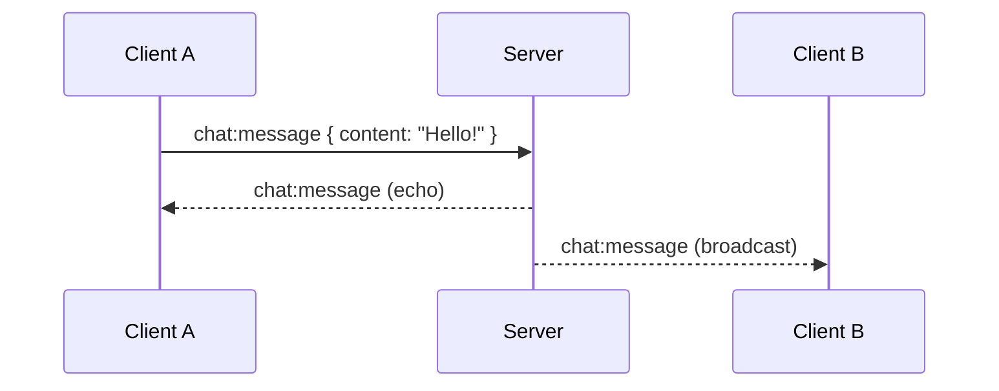
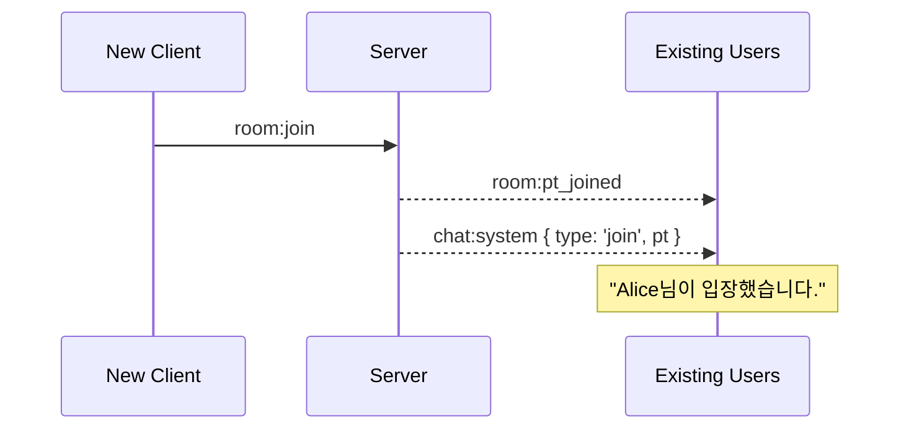

# 채팅 이벤트

실시간 채팅 시스템을 위한 Socket 이벤트입니다.

:::info 이벤트 방향

- ⬇️ **S → C**: 서버가 클라이언트로 송신
- 🔁 **C ↔ S**: 양방향 통신
  :::

:::warning Rate Limit
1초당 10회
:::

---

## 1. chat:system

⬇️ **Server → Client (Broadcast)**

시스템 메시지를 모든 참가자에게 브로드캐스트합니다.

### Payload

import Tabs from '@theme/Tabs';
import TabItem from '@theme/TabItem';

<Tabs>
  <TabItem value="schema" label="Schema" default>
    ```typescript
    {
      id: string;          // 메시지 ID (UUIDv7)
      type: 'join' | 'leave'; // 시스템 이벤트 타입
      pt: Participant;     // 관련 참가자 정보
      createdAt: string;   // 메시지 생성 시간 (ISO 8601)
    }

    // Participant Schema
    {
      id: string;          // UUIDv7
      nickname: string;    // 닉네임
      role: 'host' | 'editor' | 'viewer';
      color: string;       // 사용자 색상 (hex)
      isConnected: boolean;
      createdAt: string;
    }
    ```

  </TabItem>
  <TabItem value="join" label="입장 메시지">
    ```json
    {
      "id": "018e1234-5678-7abc-def0-abcdefabcdef",
      "type": "join",
      "pt": {
        "id": "018e1234-5678-7abc-def0-123456789abc",
        "nickname": "Alice",
        "role": "editor",
        "color": "#FF6B6B",
        "isConnected": true,
        "createdAt": "2026-02-04T12:00:00.000Z"
      },
      "createdAt": "2026-02-04T12:00:00.123Z"
    }
    ```
  </TabItem>
  <TabItem value="leave" label="퇴장 메시지">
    ```json
    {
      "id": "018e1234-5678-7abc-def0-fedcbafedcba",
      "type": "leave",
      "pt": {
        "id": "018e1234-5678-7abc-def0-987654321xyz",
        "nickname": "Bob",
        "role": "viewer",
        "color": "#4ECDC4",
        "isConnected": false,
        "createdAt": "2026-02-04T12:05:00.000Z"
      },
      "createdAt": "2026-02-04T12:15:00.456Z"
    }
    ```
  </TabItem>
</Tabs>

### 사용 예시

```typescript
socket.on('chat:system', (message) => {
  const participant = message.pt;

  if (message.type === 'join') {
    // 입장 메시지 표시
    appendSystemMessage(
      `${participant.nickname}님이 입장했습니다.`,
      participant.color,
    );
  } else if (message.type === 'leave') {
    // 퇴장 메시지 표시
    appendSystemMessage(
      `${participant.nickname}님이 퇴장했습니다.`,
      participant.color,
    );
  }

  // 채팅 목록에 추가
  addMessageToChat({
    id: message.id,
    type: 'system',
    content: `${participant.nickname}님이 ${message.type === 'join' ? '입장' : '퇴장'}했습니다.`,
    timestamp: new Date(message.createdAt),
  });
});

// 시스템 메시지 표시 함수
const appendSystemMessage = (text: string, color: string) => {
  const messageElement = document.createElement('div');
  messageElement.className = 'system-message';
  messageElement.style.color = '#888';
  messageElement.style.fontStyle = 'italic';
  messageElement.innerHTML = `
    <span style="color: ${color}">●</span> ${text}
  `;
  chatContainer.appendChild(messageElement);
};
```

:::info 자동 발송
시스템 메시지는 서버가 자동으로 생성하여 브로드캐스트합니다. 클라이언트에서 직접 발송할 수 없습니다.
:::

---

## 2. chat:message

🔁 **Client ↔ Server (Bidirectional)**

사용자 채팅 메시지를 송수신합니다.

### Payload (Client → Server)

<Tabs>
  <TabItem value="schema" label="Schema" default>
    ```typescript
    {
      content: string; // 메시지 내용 (최대 500자)
    }
    ```
  </TabItem>
  <TabItem value="example" label="Example">
    ```json
    {
      "content": "안녕하세요!"
    }
    ```
  </TabItem>
</Tabs>

### Payload (Server → Client)

<Tabs>
  <TabItem value="schema" label="Schema" default>
    ```typescript
    {
      id: string;        // 메시지 ID (UUIDv7)
      content: string;   // 메시지 내용
      pt: Participant;   // 발신자 정보
      createdAt: string; // 생성 시간 (ISO 8601)
    }
    ```
  </TabItem>
  <TabItem value="example" label="Example">
    ```json
    {
      "id": "018e1234-5678-7abc-def0-messageid123",
      "content": "안녕하세요!",
      "pt": {
        "id": "018e1234-5678-7abc-def0-123456789abc",
        "nickname": "Alice",
        "role": "editor",
        "color": "#FF6B6B",
        "isConnected": true,
        "createdAt": "2026-02-04T12:00:00.000Z"
      },
      "createdAt": "2026-02-04T12:10:30.789Z"
    }
    ```
  </TabItem>
</Tabs>

### 사용 예시

#### 메시지 전송 (Client → Server)

```typescript
const sendMessage = (content: string) => {
  // 빈 메시지 방지
  if (!content.trim()) return;

  // 길이 제한 확인
  if (content.length > 500) {
    alert('메시지는 최대 500자까지 입력할 수 있습니다.');
    return;
  }

  // 서버로 메시지 전송
  socket.emit('chat:message', { content: content.trim() });

  // 입력창 초기화
  chatInput.value = '';
};

// Enter 키로 전송
chatInput.addEventListener('keypress', (e) => {
  if (e.key === 'Enter' && !e.shiftKey) {
    e.preventDefault();
    sendMessage(chatInput.value);
  }
});
```

#### 메시지 수신 (Server → Client)

```typescript
socket.on('chat:message', (message) => {
  const isMyMessage = message.pt.id === myParticipantId;

  // 채팅 UI에 메시지 추가
  addMessageToChat({
    id: message.id,
    content: message.content,
    sender: {
      id: message.pt.id,
      nickname: message.pt.nickname,
      color: message.pt.color,
      role: message.pt.role,
    },
    timestamp: new Date(message.createdAt),
    isMyMessage,
  });

  // 새 메시지 알림 (내 메시지가 아닌 경우)
  if (!isMyMessage) {
    notifyNewMessage(message.pt.nickname);
  }

  // 자동 스크롤 (맨 아래로)
  chatContainer.scrollTop = chatContainer.scrollHeight;
});

// 메시지 UI 추가 함수
const addMessageToChat = (msg: ChatMessage) => {
  const messageElement = document.createElement('div');
  messageElement.className = msg.isMyMessage ? 'my-message' : 'other-message';

  const timeString = msg.timestamp.toLocaleTimeString('ko-KR', {
    hour: '2-digit',
    minute: '2-digit',
  });

  messageElement.innerHTML = `
    <div class="message-header">
      <span class="nickname" style="color: ${msg.sender.color}">
        ${msg.sender.nickname}
      </span>
      <span class="role-badge">${getRoleBadge(msg.sender.role)}</span>
      <span class="timestamp">${timeString}</span>
    </div>
    <div class="message-content">${escapeHtml(msg.content)}</div>
  `;

  chatContainer.appendChild(messageElement);
};

// 역할 배지 표시
const getRoleBadge = (role: string) => {
  const badges = {
    host: '👑',
    editor: '✏️',
    viewer: '👀',
  };
  return badges[role] || '';
};

// XSS 방지
const escapeHtml = (text: string) => {
  const div = document.createElement('div');
  div.textContent = text;
  return div.innerHTML;
};
```

---

## Rate Limiting

:::warning 메시지 전송 제한

- **1초당 10회** 전송 가능
- 제한 초과 시 메시지가 무시되며, 경고 알림이 표시됩니다.
  :::

### Rate Limit 처리

```typescript
let messageSentCount = 0;
let rateLimitResetTimer: NodeJS.Timeout | null = null;

const sendMessage = (content: string) => {
  // Rate Limit 확인
  if (messageSentCount >= 10) {
    alert('메시지를 너무 빠르게 전송하고 있습니다. 잠시 후 다시 시도해주세요.');
    return;
  }

  // 메시지 전송
  socket.emit('chat:message', { content });
  messageSentCount++;

  // 1초 후 카운트 리셋
  if (!rateLimitResetTimer) {
    rateLimitResetTimer = setTimeout(() => {
      messageSentCount = 0;
      rateLimitResetTimer = null;
    }, 1000);
  }
};
```

---

## 메시지 타입

### 사용자 메시지

- **발신자**: 특정 참가자
- **내용**: 사용자가 입력한 텍스트
- **표시**: 발신자 닉네임, 역할, 시간과 함께 표시

### 시스템 메시지

- **발신자**: 시스템 (자동 생성)
- **내용**: 입장/퇴장 알림
- **표시**: 회색 이탤릭체로 구분 표시

---

## React 컴포넌트 예시

```typescript
import { useState, useEffect, useRef } from 'react';
import { Socket } from 'socket.io-client';

interface ChatMessage {
  id: string;
  type: 'system' | 'user';
  content: string;
  sender?: {
    id: string;
    nickname: string;
    color: string;
    role: string;
  };
  timestamp: Date;
}

function Chat({ socket, myPtId }: Props) {
  const [messages, setMessages] = useState<ChatMessage[]>([]);
  const [inputValue, setInputValue] = useState('');
  const chatEndRef = useRef<HTMLDivElement>(null);

  useEffect(() => {
    // 시스템 메시지 수신
    socket.on('chat:system', (msg) => {
      const systemMessage: ChatMessage = {
        id: msg.id,
        type: 'system',
        content: `${msg.pt.nickname}님이 ${msg.type === 'join' ? '입장' : '퇴장'}했습니다.`,
        timestamp: new Date(msg.createdAt),
      };
      setMessages(prev => [...prev, systemMessage]);
    });

    // 사용자 메시지 수신
    socket.on('chat:message', (msg) => {
      const userMessage: ChatMessage = {
        id: msg.id,
        type: 'user',
        content: msg.content,
        sender: {
          id: msg.pt.id,
          nickname: msg.pt.nickname,
          color: msg.pt.color,
          role: msg.pt.role,
        },
        timestamp: new Date(msg.createdAt),
      };
      setMessages(prev => [...prev, userMessage]);
    });

    return () => {
      socket.off('chat:system');
      socket.off('chat:message');
    };
  }, [socket]);

  // 자동 스크롤
  useEffect(() => {
    chatEndRef.current?.scrollIntoView({ behavior: 'smooth' });
  }, [messages]);

  const handleSendMessage = (e: React.FormEvent) => {
    e.preventDefault();

    if (!inputValue.trim()) return;
    if (inputValue.length > 500) {
      alert('메시지는 최대 500자까지 입력할 수 있습니다.');
      return;
    }

    socket.emit('chat:message', { content: inputValue.trim() });
    setInputValue('');
  };

  return (
    <div className="chat-container">
      <div className="messages">
        {messages.map(msg => (
          <div
            key={msg.id}
            className={
              msg.type === 'system'
                ? 'system-message'
                : msg.sender?.id === myPtId
                ? 'my-message'
                : 'other-message'
            }
          >
            {msg.type === 'system' ? (
              <div className="system-text">{msg.content}</div>
            ) : (
              <>
                <div className="message-header">
                  <span style={{ color: msg.sender?.color }}>
                    {msg.sender?.nickname}
                  </span>
                  <span className="role">{msg.sender?.role}</span>
                  <span className="time">
                    {msg.timestamp.toLocaleTimeString('ko-KR', {
                      hour: '2-digit',
                      minute: '2-digit',
                    })}
                  </span>
                </div>
                <div className="message-content">{msg.content}</div>
              </>
            )}
          </div>
        ))}
        <div ref={chatEndRef} />
      </div>

      <form onSubmit={handleSendMessage} className="input-form">
        <input
          type="text"
          value={inputValue}
          onChange={(e) => setInputValue(e.target.value)}
          placeholder="메시지를 입력하세요..."
          maxLength={500}
        />
        <button type="submit">전송</button>
      </form>
    </div>
  );
}

export default Chat;
```

---

## 이벤트 흐름

### 메시지 전송 시퀀스



### 시스템 메시지 시퀀스



---

## 기능 제안

### 멘션 기능

```typescript
// @닉네임으로 멘션
const content = '@Alice 안녕하세요!';

socket.emit('chat:message', { content });

// 수신 시 멘션 강조
socket.on('chat:message', (msg) => {
  const highlighted = msg.content.replace(
    new RegExp(`@${myNickname}`, 'g'),
    `<strong class="mention">@${myNickname}</strong>`,
  );
  // ...
});
```

### 코드 블록

````typescript
// 마크다운 코드 블록 지원
const content = '```javascript\nconsole.log("Hello");\n```';

socket.emit('chat:message', { content });

// 수신 시 코드 하이라이팅
import { Prism } from 'prism-react-renderer';

socket.on('chat:message', (msg) => {
  const formatted = formatCodeBlocks(msg.content);
  // ...
});
````

---

## 권한

모든 역할(Host, Editor, Viewer)이 채팅을 사용할 수 있습니다.

| 권한   | 채팅 전송 | 채팅 수신 |
| ------ | --------- | --------- |
| Host   | ✅        | ✅        |
| Editor | ✅        | ✅        |
| Viewer | ✅        | ✅        |

---

## 제한 사항

- **메시지 길이**: 최대 500자
- **Rate Limit**: 1초당 10회
- **멀티미디어**: 현재 텍스트만 지원 (이미지, 파일 첨부 미지원)
- **이모지**: UTF-8 이모지 지원 ✅ 🎉 👍
