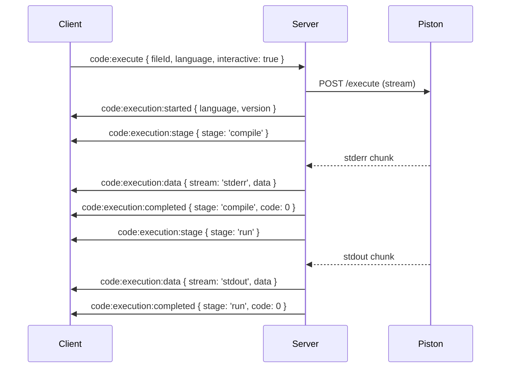
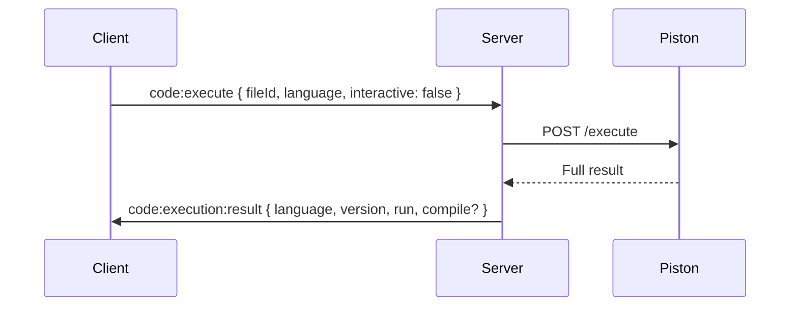

# 코드 실행 이벤트

Piston API를 통한 코드 실행 및 실시간 출력 스트리밍을 위한 Socket 이벤트입니다.

:::info 이벤트 방향

- ⬆️ **C → S**: 클라이언트가 서버로 송신
- ⬇️ **S → C**: 서버가 클라이언트로 송신
  :::

:::warning Rate Limit
60초당 6회 (Editor 또는 Host 권한 필요)
:::

---

## Piston API 개요

**Piston**은 안전한 샌드박스 환경에서 다양한 프로그래밍 언어의 코드를 실행할 수 있는 고성능 코드 실행 엔진입니다.

### 지원 언어

- **컴파일 언어**: C, C++, Rust, Go, Java 등
- **인터프리터 언어**: Python, JavaScript, Ruby, PHP 등
- **기타**: TypeScript, Kotlin, Swift 등

### 실행 모드

- **Interactive Mode**: 실시간 출력 스트리밍 (compile → run 단계 구분)
- **Non-Interactive Mode**: 전체 실행 결과를 한 번에 반환

---

## 1. code:execute

⬆️ **Client → Server**

코드 실행을 요청합니다.

### Payload

import Tabs from '@theme/Tabs';
import TabItem from '@theme/TabItem';

<Tabs>
  <TabItem value="schema" label="Schema" default>
    ```typescript
    {
      fileId: string;        // 실행할 파일 ID
      language: string;      // 프로그래밍 언어 (예: 'python', 'javascript')
      interactive: boolean;  // Interactive Mode 사용 여부
    }
    ```
  </TabItem>
  <TabItem value="interactive" label="Interactive Mode">
    ```json
    {
      "fileId": "main.py",
      "language": "python",
      "interactive": true
    }
    ```
  </TabItem>
  <TabItem value="non-interactive" label="Non-Interactive Mode">
    ```json
    {
      "fileId": "main.js",
      "language": "javascript",
      "interactive": false
    }
    ```
  </TabItem>
</Tabs>

### 사용 예시

```typescript
const executeCode = (
  fileId: string,
  language: string,
  interactive: boolean,
) => {
  socket.emit('code:execute', {
    fileId,
    language,
    interactive,
  });
};

// Interactive Mode (실시간 출력)
executeCode('main.cpp', 'cpp', true);

// Non-Interactive Mode (결과만 반환)
executeCode('script.py', 'python', false);
```

:::danger 권한 필요
이 이벤트는 **Editor 또는 Host 권한**이 있는 사용자만 실행할 수 있습니다.
:::

---

## Non-Interactive Mode

### 2. code:execution:result

⬇️ **Server → Client**

전체 실행 결과를 한 번에 반환합니다.

#### Payload

<Tabs>
  <TabItem value="schema" label="Schema" default>
    ```typescript
    {
      language: string;     // 실행된 언어
      version: string;      // 언어 버전
      run: {
        stdout: string;     // 표준 출력
        stderr: string;     // 표준 에러
        code: number;       // 종료 코드 (0: 성공)
        signal: string | null; // 시그널 (있을 경우)
        output: string;     // stdout + stderr 합친 출력
      };
      compile?: {           // 컴파일 언어인 경우
        stdout: string;
        stderr: string;
        code: number;
        signal: string | null;
        output: string;
      };
    }
    ```
  </TabItem>
  <TabItem value="success" label="성공 예시">
    ```json
    {
      "language": "python",
      "version": "3.10.0",
      "run": {
        "stdout": "Hello, World!\n",
        "stderr": "",
        "code": 0,
        "signal": null,
        "output": "Hello, World!\n"
      }
    }
    ```
  </TabItem>
  <TabItem value="error" label="에러 예시">
    ```json
    {
      "language": "python",
      "version": "3.10.0",
      "run": {
        "stdout": "",
        "stderr": "Traceback (most recent call last):\n  File \"main.py\", line 1\n    print(x)\nNameError: name 'x' is not defined\n",
        "code": 1,
        "signal": null,
        "output": "Traceback (most recent call last):\n  File \"main.py\", line 1\n    print(x)\nNameError: name 'x' is not defined\n"
      }
    }
    ```
  </TabItem>
  <TabItem value="compile" label="컴파일 언어">
    ```json
    {
      "language": "cpp",
      "version": "10.2.0",
      "compile": {
        "stdout": "",
        "stderr": "",
        "code": 0,
        "signal": null,
        "output": ""
      },
      "run": {
        "stdout": "Hello from C++!\n",
        "stderr": "",
        "code": 0,
        "signal": null,
        "output": "Hello from C++!\n"
      }
    }
    ```
  </TabItem>
</Tabs>

#### 사용 예시

```typescript
socket.on('code:execution:result', (result) => {
  if (result.run.code === 0) {
    console.log('실행 성공!');
    console.log('출력:', result.run.stdout);
  } else {
    console.error('실행 실패 (종료 코드:', result.run.code, ')');
    console.error('에러:', result.run.stderr);
  }

  // 컴파일 언어인 경우
  if (result.compile) {
    if (result.compile.code !== 0) {
      console.error('컴파일 에러:', result.compile.stderr);
    }
  }
});
```

---

## Interactive Mode

실시간으로 컴파일 및 실행 과정을 스트리밍합니다.

### 3. code:execution:started

⬇️ **Server → Client**

코드 실행이 시작되었음을 알립니다.

#### Payload

<Tabs>
  <TabItem value="schema" label="Schema" default>
    ```typescript
    {
      language: string;  // 실행 언어
      version: string;   // 언어 버전
    }
    ```
  </TabItem>
  <TabItem value="example" label="Example">
    ```json
    {
      "language": "cpp",
      "version": "10.2.0"
    }
    ```
  </TabItem>
</Tabs>

#### 사용 예시

```typescript
socket.on('code:execution:started', (payload) => {
  console.log(`${payload.language} (${payload.version}) 실행 시작`);
  // UI에 로딩 표시
  setExecutionStatus('running');
});
```

---

### 4. code:execution:stage

⬇️ **Server → Client**

실행 단계가 변경되었음을 알립니다 (`compile` → `run`).

#### Payload

<Tabs>
  <TabItem value="schema" label="Schema" default>
    ```typescript
    {
      stage: 'compile' | 'run'; // 현재 단계
    }
    ```
  </TabItem>
  <TabItem value="compile" label="Compile Stage">
    ```json
    {
      "stage": "compile"
    }
    ```
  </TabItem>
  <TabItem value="run" label="Run Stage">
    ```json
    {
      "stage": "run"
    }
    ```
  </TabItem>
</Tabs>

#### 사용 예시

```typescript
socket.on('code:execution:stage', (payload) => {
  if (payload.stage === 'compile') {
    console.log('컴파일 중...');
    setCurrentStage('compile');
  } else if (payload.stage === 'run') {
    console.log('실행 중...');
    setCurrentStage('run');
  }
});
```

:::info 단계 구분
컴파일 언어(C, C++, Java 등)는 `compile` → `run` 순서로 진행되며, 인터프리터 언어(Python, JavaScript 등)는 `run`만 있습니다.
:::

---

### 5. code:execution:data

⬇️ **Server → Client**

실시간 출력 데이터를 스트리밍합니다.

#### Payload

<Tabs>
  <TabItem value="schema" label="Schema" default>
    ```typescript
    {
      stream: 'stdout' | 'stderr'; // 출력 스트림 종류
      data: string;                 // 출력 데이터
    }
    ```
  </TabItem>
  <TabItem value="stdout" label="Standard Output">
    ```json
    {
      "stream": "stdout",
      "data": "Hello, World!\n"
    }
    ```
  </TabItem>
  <TabItem value="stderr" label="Standard Error">
    ```json
    {
      "stream": "stderr",
      "data": "Warning: unused variable\n"
    }
    ```
  </TabItem>
</Tabs>

#### 사용 예시

```typescript
socket.on('code:execution:data', (payload) => {
  if (payload.stream === 'stdout') {
    // 표준 출력 (일반 출력)
    appendOutput(payload.data, 'stdout');
  } else if (payload.stream === 'stderr') {
    // 표준 에러 (경고/에러 메시지)
    appendOutput(payload.data, 'stderr');
  }
});

// 예시: 터미널에 출력 추가
const appendOutput = (data: string, stream: 'stdout' | 'stderr') => {
  const color = stream === 'stderr' ? 'red' : 'white';
  terminalElement.innerHTML += `<span style="color: ${color}">${data}</span>`;
};
```

:::tip 실시간 스트리밍
`code:execution:data`는 출력이 생성되는 즉시 전송되므로, 사용자는 실행 과정을 실시간으로 볼 수 있습니다.
:::

---

### 6. code:execution:completed

⬇️ **Server → Client**

현재 단계(compile 또는 run)가 완료되었음을 알립니다.

#### Payload

<Tabs>
  <TabItem value="schema" label="Schema" default>
    ```typescript
    {
      stage: 'compile' | 'run'; // 완료된 단계
      code: number;              // 종료 코드 (0: 성공)
      signal: string | null;     // 시그널 (있을 경우)
    }
    ```
  </TabItem>
  <TabItem value="success" label="성공">
    ```json
    {
      "stage": "run",
      "code": 0,
      "signal": null
    }
    ```
  </TabItem>
  <TabItem value="failure" label="실패">
    ```json
    {
      "stage": "compile",
      "code": 1,
      "signal": null
    }
    ```
  </TabItem>
</Tabs>

#### 사용 예시

```typescript
socket.on('code:execution:completed', (payload) => {
  if (payload.code === 0) {
    console.log(`${payload.stage} 단계 완료 (성공)`);
  } else {
    console.error(
      `${payload.stage} 단계 완료 (실패: 종료 코드 ${payload.code})`,
    );
  }

  // 실행 단계가 완료된 경우 UI 업데이트
  if (payload.stage === 'run') {
    setExecutionStatus('completed');
  }
});
```

---

## 공통 이벤트

### 7. code:execution:error

⬇️ **Server → Client**

코드 실행 중 에러가 발생했을 때 전송됩니다 (모든 모드 공통).

#### Payload

<Tabs>
  <TabItem value="schema" label="Schema" default>
    ```typescript
    {
      message: string; // 에러 메시지
      code?: string;   // 에러 코드 (선택)
    }
    ```
  </TabItem>
  <TabItem value="rate-limit" label="Rate Limit">
    ```json
    {
      "message": "실행 요청이 너무 많습니다. 잠시 후 다시 시도해주세요.",
      "code": "RATE_LIMIT_EXCEEDED"
    }
    ```
  </TabItem>
  <TabItem value="permission" label="권한 부족">
    ```json
    {
      "message": "코드 실행 권한이 없습니다.",
      "code": "PERMISSION_DENIED"
    }
    ```
  </TabItem>
  <TabItem value="timeout" label="타임아웃">
    ```json
    {
      "message": "코드 실행 시간이 초과되었습니다.",
      "code": "EXECUTION_TIMEOUT"
    }
    ```
  </TabItem>
</Tabs>

#### 사용 예시

```typescript
socket.on('code:execution:error', (error) => {
  console.error('실행 에러:', error.message);

  if (error.code === 'RATE_LIMIT_EXCEEDED') {
    alert('실행 요청이 너무 많습니다. 잠시 후 다시 시도해주세요.');
  } else if (error.code === 'PERMISSION_DENIED') {
    alert('코드 실행 권한이 없습니다.');
  } else {
    alert(`에러: ${error.message}`);
  }

  setExecutionStatus('error');
});
```

---

## 통합 사용 예시

### React 컴포넌트 (Interactive Mode)

```typescript
import { useState, useEffect } from 'react';
import { Socket } from 'socket.io-client';

function CodeExecutor({ socket, fileId, language }: Props) {
  const [output, setOutput] = useState('');
  const [isRunning, setIsRunning] = useState(false);
  const [currentStage, setCurrentStage] = useState<string | null>(null);

  useEffect(() => {
    // 실행 시작
    socket.on('code:execution:started', (payload) => {
      console.log(`${payload.language} ${payload.version} 실행 시작`);
      setIsRunning(true);
      setOutput('');
    });

    // 단계 변경
    socket.on('code:execution:stage', (payload) => {
      setCurrentStage(payload.stage);
      setOutput(prev => prev + `\n=== ${payload.stage.toUpperCase()} ===\n`);
    });

    // 실시간 출력
    socket.on('code:execution:data', (payload) => {
      const color = payload.stream === 'stderr' ? 'red' : 'white';
      setOutput(prev => prev + `[${payload.stream}] ${payload.data}`);
    });

    // 단계 완료
    socket.on('code:execution:completed', (payload) => {
      const status = payload.code === 0 ? '성공' : '실패';
      setOutput(prev => prev + `\n[${payload.stage} ${status}: 종료 코드 ${payload.code}]\n`);

      if (payload.stage === 'run') {
        setIsRunning(false);
        setCurrentStage(null);
      }
    });

    // 에러
    socket.on('code:execution:error', (error) => {
      setOutput(prev => prev + `\n[ERROR] ${error.message}\n`);
      setIsRunning(false);
      setCurrentStage(null);
    });

    return () => {
      socket.off('code:execution:started');
      socket.off('code:execution:stage');
      socket.off('code:execution:data');
      socket.off('code:execution:completed');
      socket.off('code:execution:error');
    };
  }, [socket]);

  const executeCode = () => {
    socket.emit('code:execute', {
      fileId,
      language,
      interactive: true,
    });
  };

  return (
    <div>
      <button onClick={executeCode} disabled={isRunning}>
        {isRunning ? '실행 중...' : '코드 실행'}
      </button>
      {currentStage && <div>현재 단계: {currentStage}</div>}
      <pre>{output}</pre>
    </div>
  );
}
```

---

## 이벤트 흐름

### Interactive Mode (컴파일 언어)



### Non-Interactive Mode



---

## 제한 사항

### Rate Limit

:::warning 실행 제한

- **60초당 6회** 실행 가능
- 제한 초과 시 `code:execution:error` 이벤트 발생
  :::

### 권한

| 권한   | 코드 실행 |
| ------ | --------- |
| Host   | ✅        |
| Editor | ✅        |
| Viewer | ❌        |

### 타임아웃

- **컴파일**: 최대 10초
- **실행**: 최대 5초
- 초과 시 자동 종료

---

## 참고 문서

- [Piston GitHub](https://github.com/engineer-man/piston)
- [Piston API Documentation](https://github.com/engineer-man/piston#api)
