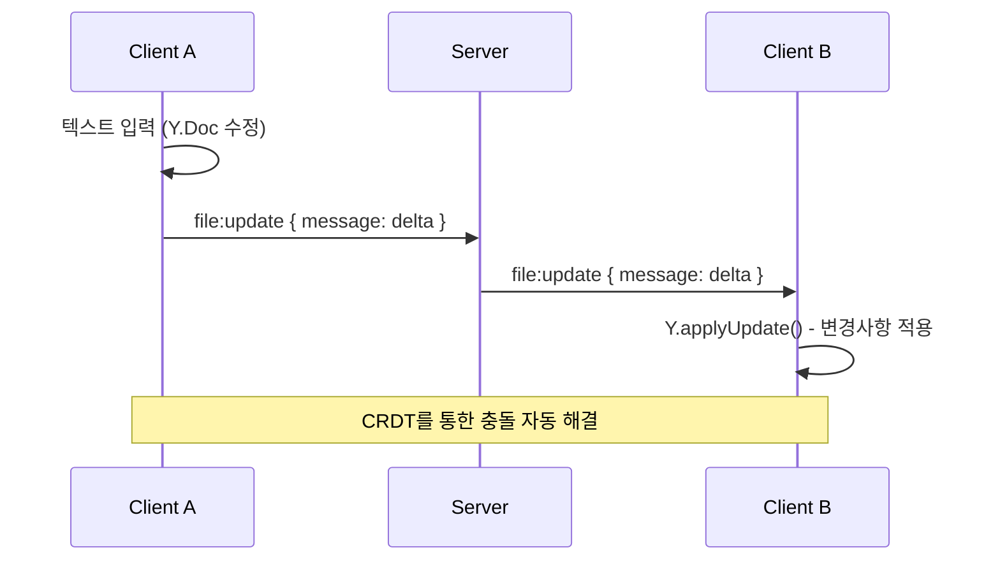
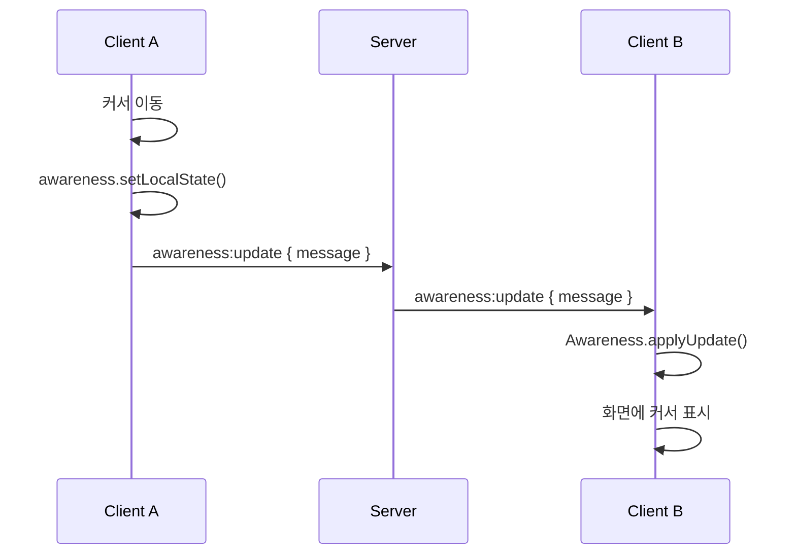

# 파일 동기화 이벤트

Y.js 기반 CRDT 문서 동기화를 위한 Socket 이벤트입니다.

:::info 이벤트 방향

- ⬆️ **C → S**: 클라이언트가 서버로 송신
- ⬇️ **S → C**: 서버가 클라이언트로 송신
- 🔁 **C ↔ S**: 양방향 통신
  :::

---

## Y.js CRDT 개요

Y.js는 **CRDT (Conflict-free Replicated Data Type)** 를 구현한 라이브러리로, 실시간 협업 문서 편집을 가능하게 합니다.

### 주요 특징

- **충돌 자동 해결**: 여러 사용자가 동시에 편집해도 데이터 일관성 유지
- **오프라인 지원**: 오프라인 상태에서도 편집 가능, 재연결 시 자동 동기화
- **효율적인 동기화**: 변경사항(delta)만 전송하여 네트워크 효율성 극대화
- **Undo/Redo 지원**: 작업 이력 관리

---

## 1. file:update

🔁 **Client ↔ Server (Bidirectional)**

파일(문서) 변경사항을 동기화합니다.

### Payload

import Tabs from '@theme/Tabs';
import TabItem from '@theme/TabItem';

<Tabs>
  <TabItem value="schema" label="Schema" default>
    ```typescript
    {
      message: Uint8Array; // Y.js 인코딩된 변경사항 (delta)
    }
    ```
  </TabItem>
  <TabItem value="note" label="Note">
    ```typescript
    // message는 Y.js가 자동으로 생성하는 바이너리 데이터입니다.
    // 직접 생성할 필요 없이 Y.js 라이브러리가 처리합니다.
    ```
  </TabItem>
</Tabs>

### 사용 예시 (Client → Server)

```typescript
import * as Y from 'yjs';

const ydoc = new Y.Doc();

// Y.Doc의 변경사항을 감지하여 서버로 전송
ydoc.on('update', (update: Uint8Array) => {
  socket.emit('file:update', { message: update });
});

// 파일 편집 (Y.js가 자동으로 update 이벤트 발생)
const ytext = ydoc.getText('content');
ytext.insert(0, 'Hello, World!');
```

### 사용 예시 (Server → Client)

```typescript
// 서버로부터 받은 변경사항을 Y.Doc에 적용
socket.on('file:update', (payload) => {
  const update = new Uint8Array(payload.message);
  Y.applyUpdate(ydoc, update);
});
```

:::tip 성능 최적화
Y.js는 변경사항을 자동으로 병합(merge)하므로, 여러 사용자의 동시 편집도 효율적으로 처리됩니다.
:::

---

## 2. awareness:update

🔁 **Client ↔ Server (Bidirectional)**

사용자의 실시간 상태(커서 위치, 선택 영역, 활동 상태 등)를 동기화합니다.

### Payload

<Tabs>
  <TabItem value="schema" label="Schema" default>
    ```typescript
    {
      message: Uint8Array; // Awareness 인코딩된 상태
    }
    ```
  </TabItem>
</Tabs>

### 사용 예시 (Client → Server)

```typescript
import { Awareness } from 'y-protocols/awareness';

const awareness = new Awareness(ydoc);

// 로컬 상태 설정 (커서 위치, 사용자 정보 등)
awareness.setLocalState({
  user: {
    name: 'Alice',
    color: '#FF6B6B',
  },
  cursor: {
    line: 10,
    ch: 5,
  },
  selection: {
    from: { line: 10, ch: 5 },
    to: { line: 10, ch: 15 },
  },
});

// Awareness 변경사항을 서버로 전송
awareness.on('update', ({ added, updated, removed }) => {
  const update = Awareness.encodeAwarenessUpdate(awareness, [
    ...added,
    ...updated,
    ...removed,
  ]);
  socket.emit('awareness:update', { message: update });
});
```

### 사용 예시 (Server → Client)

```typescript
// 서버로부터 받은 Awareness 업데이트 적용
socket.on('awareness:update', (payload) => {
  const update = new Uint8Array(payload.message);
  Awareness.applyAwarenessUpdate(awareness, update, 'remote');
});

// 다른 사용자의 상태 확인
awareness.on('change', () => {
  const states = awareness.getStates();
  states.forEach((state, clientId) => {
    if (clientId !== awareness.clientID) {
      console.log('다른 사용자:', state.user.name);
      console.log('커서 위치:', state.cursor);
    }
  });
});
```

:::info Awareness 용도
Awareness는 **일시적인 상태**를 공유하는 데 사용됩니다:

- 커서 위치 (cursor position)
- 텍스트 선택 영역 (text selection)
- 활동 상태 (active/idle)
- 사용자 정보 (이름, 색상 등)
  :::

---

## 3. doc:request

⬆️ **Client → Server**

문서의 전체 초기 상태를 요청합니다 (재연결 또는 동기화 실패 시).

### Payload

<Tabs>
  <TabItem value="schema" label="Schema" default>
    ```typescript
    {} // 빈 객체
    ```
  </TabItem>
</Tabs>

### 사용 예시

```typescript
// 문서 초기 상태 요청
socket.emit('doc:request', {});

// 서버 응답 대기 (room:doc 이벤트로 수신)
socket.on('room:doc', (payload) => {
  const state = new Uint8Array(payload.message);
  Y.applyUpdate(ydoc, state);
  console.log('문서 초기 상태 로드 완료');
});
```

:::tip 재연결 시나리오
네트워크 연결이 끊겼다가 재연결되었을 때, `doc:request`를 사용하여 최신 문서 상태를 가져올 수 있습니다.
:::

---

## 4. awareness:request

⬆️ **Client → Server**

Awareness의 전체 초기 상태를 요청합니다.

### Payload

<Tabs>
  <TabItem value="schema" label="Schema" default>
    ```typescript
    {} // 빈 객체
    ```
  </TabItem>
</Tabs>

### 사용 예시

```typescript
// Awareness 초기 상태 요청
socket.emit('awareness:request', {});

// 서버 응답 대기 (room:awareness 이벤트로 수신)
socket.on('room:awareness', (payload) => {
  const state = new Uint8Array(payload.message);
  Awareness.applyAwarenessUpdate(awareness, state, 'remote');
  console.log('Awareness 초기 상태 로드 완료');
});
```

---

## 통합 사용 예시

### React 컴포넌트에서 Y.js 사용

```typescript
import { useEffect, useRef } from 'react';
import * as Y from 'yjs';
import { Awareness } from 'y-protocols/awareness';
import { io } from 'socket.io-client';

function CollaborativeEditor({ roomCode, token }) {
  const ydocRef = useRef<Y.Doc | null>(null);
  const awarenessRef = useRef<Awareness | null>(null);
  const socketRef = useRef<Socket | null>(null);

  useEffect(() => {
    // Y.Doc 초기화
    const ydoc = new Y.Doc();
    ydocRef.current = ydoc;

    // Awareness 초기화
    const awareness = new Awareness(ydoc);
    awarenessRef.current = awareness;

    // Socket 연결
    const socket = io('wss://your-server.com');
    socketRef.current = socket;

    // 방 입장
    socket.emit('room:join', { roomCode, token });

    // === 문서 동기화 ===

    // 로컬 변경사항 → 서버 전송
    ydoc.on('update', (update: Uint8Array) => {
      socket.emit('file:update', { message: update });
    });

    // 서버 변경사항 → 로컬 적용
    socket.on('file:update', (payload) => {
      Y.applyUpdate(ydoc, new Uint8Array(payload.message));
    });

    // 초기 문서 상태 수신
    socket.on('room:doc', (payload) => {
      Y.applyUpdate(ydoc, new Uint8Array(payload.message));
    });

    // === Awareness 동기화 ===

    // 로컬 상태 설정
    awareness.setLocalState({
      user: { name: 'Alice', color: '#FF6B6B' },
      cursor: null,
    });

    // 로컬 Awareness → 서버 전송
    awareness.on('update', ({ added, updated, removed }) => {
      const update = Awareness.encodeAwarenessUpdate(awareness, [
        ...added,
        ...updated,
        ...removed,
      ]);
      socket.emit('awareness:update', { message: update });
    });

    // 서버 Awareness → 로컬 적용
    socket.on('awareness:update', (payload) => {
      Awareness.applyAwarenessUpdate(
        awareness,
        new Uint8Array(payload.message),
        'remote'
      );
    });

    // 초기 Awareness 상태 수신
    socket.on('room:awareness', (payload) => {
      Awareness.applyAwarenessUpdate(
        awareness,
        new Uint8Array(payload.message),
        'remote'
      );
    });

    // Cleanup
    return () => {
      socket.disconnect();
      ydoc.destroy();
    };
  }, [roomCode, token]);

  return <div>Collaborative Editor</div>;
}
```

---

## 데이터 흐름

### 문서 편집 시퀀스



### Awareness 업데이트 시퀀스



---

## Y.js 데이터 구조

### Y.Text (텍스트)

```typescript
const ytext = ydoc.getText('content');

// 텍스트 삽입
ytext.insert(0, 'Hello');
ytext.insert(5, ' World');

// 텍스트 삭제
ytext.delete(5, 6); // ' World' 삭제

// 텍스트 읽기
console.log(ytext.toString()); // "Hello"
```

### Y.Map (키-값)

```typescript
const ymap = ydoc.getMap('metadata');

// 값 설정
ymap.set('language', 'javascript');
ymap.set('theme', 'dark');

// 값 읽기
console.log(ymap.get('language')); // "javascript"

// 값 삭제
ymap.delete('theme');
```

### Y.Array (배열)

```typescript
const yarray = ydoc.getArray('files');

// 항목 추가
yarray.push([{ name: 'index.js', content: '' }]);

// 항목 읽기
console.log(yarray.get(0)); // { name: 'index.js', content: '' }

// 항목 삭제
yarray.delete(0, 1);
```

---

## 권한 제어

:::danger Editor 권한 필요
`file:update` 이벤트는 **Editor 또는 Host 권한**이 있는 사용자만 발행할 수 있습니다.

Viewer는 문서를 읽을 수만 있으며, 편집 시도 시 서버에서 거부됩니다.
:::

### 권한별 가능한 작업

| 권한   | file:update (편집) | Awareness (커서) |
| ------ | ------------------ | ---------------- |
| Host   | ✅                 | ✅               |
| Editor | ✅                 | ✅               |
| Viewer | ❌                 | ✅               |

---

## 오류 처리

### 동기화 실패 시

```typescript
socket.on('connect_error', () => {
  console.error('서버 연결 실패');
});

socket.on('disconnect', () => {
  console.warn('서버 연결 끊김');

  // 재연결 시 문서 상태 재요청
  socket.on('connect', () => {
    socket.emit('doc:request', {});
    socket.emit('awareness:request', {});
  });
});
```

### 권한 부족 오류

```typescript
socket.on('error', (error) => {
  if (error.code === 'PERMISSION_DENIED') {
    alert('편집 권한이 없습니다.');
  }
});
```

---

## 성능 최적화

### Debouncing

빈번한 업데이트를 방지하기 위해 debounce 적용:

```typescript
import { debounce } from 'lodash';

const sendUpdate = debounce((update: Uint8Array) => {
  socket.emit('file:update', { message: update });
}, 100); // 100ms 대기

ydoc.on('update', sendUpdate);
```

### Update 병합

Y.js는 자동으로 여러 업데이트를 병합하므로, 별도 처리 불필요합니다.

---

## 참고 문서

- [Y.js 공식 문서](https://docs.yjs.dev/)
- [Y.js GitHub](https://github.com/yjs/yjs)
- [Awareness Protocol](https://github.com/yjs/y-protocols)
