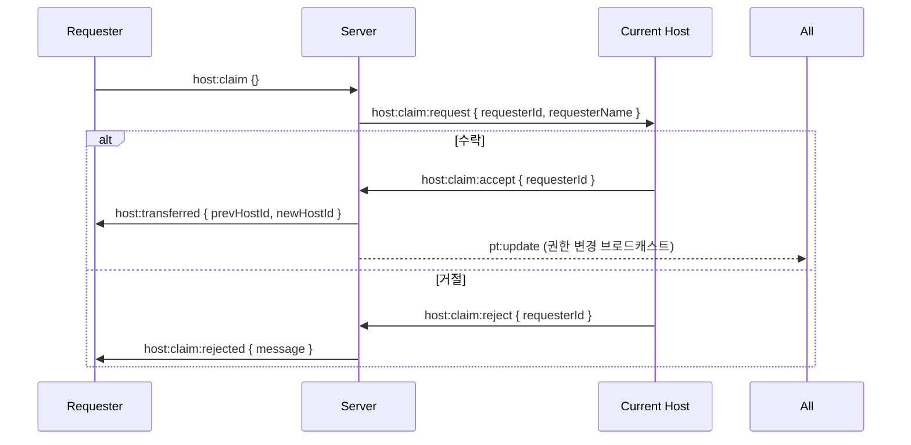
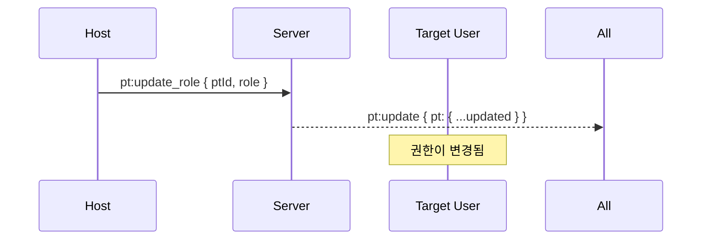

# 참가자 이벤트

참가자(Participant) 상태 및 권한 관리를 위한 Socket 이벤트입니다.

:::info 이벤트 방향

- ⬆️ **C → S**: 클라이언트가 서버로 송신
- ⬇️ **S → C**: 서버가 클라이언트로 송신
  :::

---

## 참가자 상태 관리

### 1. room:pt_joined

⬇️ **Server → Client (Broadcast)**

새로운 참가자가 방에 입장했을 때 모든 참가자에게 브로드캐스트됩니다.

#### Payload

import Tabs from '@theme/Tabs';
import TabItem from '@theme/TabItem';

<Tabs>
  <TabItem value="schema" label="Schema" default>
    ```typescript
    {
      pt: Participant; // 입장한 참가자 정보
    }

    // Participant Schema
    {
      id: string;          // UUIDv7
      nickname: string;    // 닉네임
      role: 'host' | 'editor' | 'viewer'; // 권한
      color: string;       // 사용자 색상 (hex)
      isConnected: boolean; // 연결 상태
      createdAt: string;   // 생성 시간 (ISO 8601)
    }
    ```

  </TabItem>
  <TabItem value="example" label="Example">
    ```json
    {
      "pt": {
        "id": "018e1234-5678-7abc-def0-123456789abc",
        "nickname": "Charlie",
        "role": "editor",
        "color": "#95E1D3",
        "isConnected": true,
        "createdAt": "2026-02-04T12:10:00.000Z"
      }
    }
    ```
  </TabItem>
</Tabs>

#### 사용 예시

```typescript
socket.on('room:pt_joined', (payload) => {
  const newParticipant = payload.pt;
  console.log(`${newParticipant.nickname}님이 입장했습니다.`);

  // 참가자 목록에 추가
  setParticipants((prev) => [...prev, newParticipant]);
});
```

---

### 2. room:pt_disconnect

⬇️ **Server → Client (Broadcast)**

참가자의 연결이 끊어졌을 때 브로드캐스트됩니다.

#### Payload

<Tabs>
  <TabItem value="schema" label="Schema" default>
    ```typescript
    {
      ptId: string; // 연결이 끊긴 참가자 ID
    }
    ```
  </TabItem>
  <TabItem value="example" label="Example">
    ```json
    {
      "ptId": "018e1234-5678-7abc-def0-123456789abc"
    }
    ```
  </TabItem>
</Tabs>

:::info 재연결
연결이 끊긴 참가자는 일정 시간 내에 재연결할 수 있습니다. 완전히 퇴장한 것이 아닙니다.
:::

#### 사용 예시

```typescript
socket.on('room:pt_disconnect', (payload) => {
  // 참가자를 비활성 상태로 표시
  setParticipants((prev) =>
    prev.map((pt) =>
      pt.id === payload.ptId ? { ...pt, isConnected: false } : pt,
    ),
  );
});
```

---

### 3. room:pt_left

⬇️ **Server → Client (Broadcast)**

참가자가 방에서 완전히 퇴장했을 때 브로드캐스트됩니다.

#### Payload

<Tabs>
  <TabItem value="schema" label="Schema" default>
    ```typescript
    {
      ptId: string; // 퇴장한 참가자 ID
    }
    ```
  </TabItem>
  <TabItem value="example" label="Example">
    ```json
    {
      "ptId": "018e1234-5678-7abc-def0-123456789abc"
    }
    ```
  </TabItem>
</Tabs>

#### 사용 예시

```typescript
socket.on('room:pt_left', (payload) => {
  // 참가자 목록에서 제거
  setParticipants((prev) => prev.filter((pt) => pt.id !== payload.ptId));
});
```

---

## 참가자 정보 변경

### 4. pt:update

⬇️ **Server → Client (Broadcast)**

참가자의 정보(닉네임, 권한 등)가 변경되었을 때 브로드캐스트됩니다.

#### Payload

<Tabs>
  <TabItem value="schema" label="Schema" default>
    ```typescript
    {
      pt: Participant; // 업데이트된 참가자 정보
    }
    ```
  </TabItem>
  <TabItem value="nickname" label="닉네임 변경">
    ```json
    {
      "pt": {
        "id": "018e1234-5678-7abc-def0-123456789abc",
        "nickname": "NewNickname",
        "role": "editor",
        "color": "#95E1D3",
        "isConnected": true,
        "createdAt": "2026-02-04T12:10:00.000Z"
      }
    }
    ```
  </TabItem>
  <TabItem value="role" label="권한 변경">
    ```json
    {
      "pt": {
        "id": "018e1234-5678-7abc-def0-123456789abc",
        "nickname": "Charlie",
        "role": "viewer",
        "color": "#95E1D3",
        "isConnected": true,
        "createdAt": "2026-02-04T12:10:00.000Z"
      }
    }
    ```
  </TabItem>
</Tabs>

#### 사용 예시

```typescript
socket.on('pt:update', (payload) => {
  const updatedPt = payload.pt;

  // 참가자 정보 업데이트
  setParticipants((prev) =>
    prev.map((pt) => (pt.id === updatedPt.id ? updatedPt : pt)),
  );

  // 본인의 정보가 변경된 경우
  if (updatedPt.id === myPtId) {
    console.log('내 정보가 업데이트되었습니다.');
    setMyRole(updatedPt.role);
  }
});
```

---

### 5. pt:update_role

⬆️ **Client → Server**

다른 참가자의 권한을 변경합니다. **Host만 가능**합니다.

#### Payload

<Tabs>
  <TabItem value="schema" label="Schema" default>
    ```typescript
    {
      ptId: string;                        // 대상 참가자 ID
      role: 'host' | 'editor' | 'viewer'; // 변경할 권한
    }
    ```
  </TabItem>
  <TabItem value="to-viewer" label="Viewer로 변경">
    ```json
    {
      "ptId": "018e1234-5678-7abc-def0-123456789abc",
      "role": "viewer"
    }
    ```
  </TabItem>
  <TabItem value="to-editor" label="Editor로 변경">
    ```json
    {
      "ptId": "018e1234-5678-7abc-def0-123456789abc",
      "role": "editor"
    }
    ```
  </TabItem>
</Tabs>

:::danger 권한 필요
이 이벤트는 **Host 권한**이 있는 사용자만 실행할 수 있습니다.
:::

#### 사용 예시

```typescript
const changeParticipantRole = (ptId: string, newRole: Role) => {
  if (myRole === 'host') {
    socket.emit('pt:update_role', { ptId, role: newRole });
  }
};
```

---

### 6. pt:update_nickname

⬆️ **Client → Server**

자신의 닉네임을 변경합니다.

#### Payload

<Tabs>
  <TabItem value="schema" label="Schema" default>
    ```typescript
    {
      nickname: string; // 새 닉네임 (최대 20자)
    }
    ```
  </TabItem>
  <TabItem value="example" label="Example">
    ```json
    {
      "nickname": "NewNickname"
    }
    ```
  </TabItem>
</Tabs>

#### 사용 예시

```typescript
const updateNickname = (newNickname: string) => {
  if (newNickname.length > 0 && newNickname.length <= 20) {
    socket.emit('pt:update_nickname', { nickname: newNickname });
  }
};
```

---

## 호스트 권한 관리

### 7. host:transferred

⬇️ **Server → Client (Broadcast)**

호스트 권한이 다른 사용자에게 이전되었을 때 브로드캐스트됩니다.

#### Payload

<Tabs>
  <TabItem value="schema" label="Schema" default>
    ```typescript
    {
      prevHostId: string; // 이전 호스트 ID
      newHostId: string;  // 새 호스트 ID
    }
    ```
  </TabItem>
  <TabItem value="example" label="Example">
    ```json
    {
      "prevHostId": "018e1234-5678-7abc-def0-111111111111",
      "newHostId": "018e1234-5678-7abc-def0-222222222222"
    }
    ```
  </TabItem>
</Tabs>

#### 사용 예시

```typescript
socket.on('host:transferred', (payload) => {
  if (payload.newHostId === myPtId) {
    console.log('나에게 호스트 권한이 이전되었습니다!');
    setMyRole('host');
  }

  // 참가자 역할 업데이트
  setParticipants((prev) =>
    prev.map((pt) => ({
      ...pt,
      role:
        pt.id === payload.newHostId
          ? 'host'
          : pt.id === payload.prevHostId
            ? 'editor'
            : pt.role,
    })),
  );
});
```

---

### 8. host:claim

⬆️ **Client → Server**

호스트 권한을 요청합니다 (현재 호스트가 없거나 연결이 끊긴 경우).

#### Payload

<Tabs>
  <TabItem value="schema" label="Schema" default>
    ```typescript
    {} // 빈 객체
    ```
  </TabItem>
</Tabs>

#### 사용 예시

```typescript
const requestHostRole = () => {
  socket.emit('host:claim', {});
};
```

---

### 9. host:claim:request

⬇️ **Server → Client**

현재 호스트에게 권한 요청이 왔음을 알립니다.

#### Payload

<Tabs>
  <TabItem value="schema" label="Schema" default>
    ```typescript
    {
      requesterId: string;   // 요청자 ID
      requesterName: string; // 요청자 닉네임
    }
    ```
  </TabItem>
  <TabItem value="example" label="Example">
    ```json
    {
      "requesterId": "018e1234-5678-7abc-def0-333333333333",
      "requesterName": "Alice"
    }
    ```
  </TabItem>
</Tabs>

#### 사용 예시

```typescript
socket.on('host:claim:request', (payload) => {
  const accept = confirm(
    `${payload.requesterName}님이 호스트 권한을 요청했습니다. 수락하시겠습니까?`,
  );

  if (accept) {
    socket.emit('host:claim:accept', { requesterId: payload.requesterId });
  } else {
    socket.emit('host:claim:reject', { requesterId: payload.requesterId });
  }
});
```

---

### 10. host:claim:accept

⬆️ **Client → Server**

호스트 권한 요청을 수락합니다.

#### Payload

<Tabs>
  <TabItem value="schema" label="Schema" default>
    ```typescript
    {
      requesterId: string; // 요청자 ID
    }
    ```
  </TabItem>
  <TabItem value="example" label="Example">
    ```json
    {
      "requesterId": "018e1234-5678-7abc-def0-333333333333"
    }
    ```
  </TabItem>
</Tabs>

---

### 11. host:claim:reject

⬆️ **Client → Server**

호스트 권한 요청을 거절합니다.

#### Payload

<Tabs>
  <TabItem value="schema" label="Schema" default>
    ```typescript
    {
      requesterId: string; // 요청자 ID
    }
    ```
  </TabItem>
  <TabItem value="example" label="Example">
    ```json
    {
      "requesterId": "018e1234-5678-7abc-def0-333333333333"
    }
    ```
  </TabItem>
</Tabs>

---

### 12. host:claim:rejected

⬇️ **Server → Client**

호스트 권한 요청이 거절되었음을 요청자에게 알립니다.

#### Payload

<Tabs>
  <TabItem value="schema" label="Schema" default>
    ```typescript
    {
      message: string; // "호스트가 권한 요청을 거절했습니다."
    }
    ```
  </TabItem>
  <TabItem value="example" label="Example">
    ```json
    {
      "message": "호스트가 권한 요청을 거절했습니다."
    }
    ```
  </TabItem>
</Tabs>

#### 사용 예시

```typescript
socket.on('host:claim:rejected', (payload) => {
  alert(payload.message);
});
```

---

### 13. host:claim:cancelled

⬇️ **Server → Client**

호스트 권한 요청이 취소되었음을 알립니다 (요청자가 퇴장한 경우 등).

#### Payload

<Tabs>
  <TabItem value="schema" label="Schema" default>
    ```typescript
    {
      message: string; // "권한 요청이 취소되었습니다."
    }
    ```
  </TabItem>
  <TabItem value="example" label="Example">
    ```json
    {
      "message": "권한 요청이 취소되었습니다."
    }
    ```
  </TabItem>
</Tabs>

---

### 14. host:claim:failed

⬇️ **Server → Client**

호스트 권한 요청이 실패했음을 알립니다.

#### Payload

<Tabs>
  <TabItem value="schema" label="Schema" default>
    ```typescript
    {
      message: string; // 실패 사유
    }
    ```
  </TabItem>
  <TabItem value="example" label="Example">
    ```json
    {
      "message": "이미 활성화된 호스트가 존재합니다."
    }
    ```
  </TabItem>
</Tabs>

---

## 권한 시스템

### 권한 레벨

| Role     | 설명   | 가능한 작업                                  |
| -------- | ------ | -------------------------------------------- |
| `host`   | 방장   | 모든 권한 (권한 변경, 방 폭파, 파일 편집 등) |
| `editor` | 편집자 | 파일 편집, 코드 실행, 채팅                   |
| `viewer` | 관람자 | 읽기, 채팅만 가능 (편집 및 코드 실행 불가)   |

### 권한별 가능한 이벤트

| 이벤트               | Host | Editor | Viewer |
| -------------------- | ---- | ------ | ------ |
| `pt:update_role`     | ✅   | ❌     | ❌     |
| `pt:update_nickname` | ✅   | ✅     | ✅     |
| `room:destroy`       | ✅   | ❌     | ❌     |
| `file:update`        | ✅   | ✅     | ❌     |
| `code:execute`       | ✅   | ✅     | ❌     |
| `chat:message`       | ✅   | ✅     | ✅     |

---

## 이벤트 흐름

### 호스트 권한 요청 시퀀스



### 권한 변경 시퀀스


