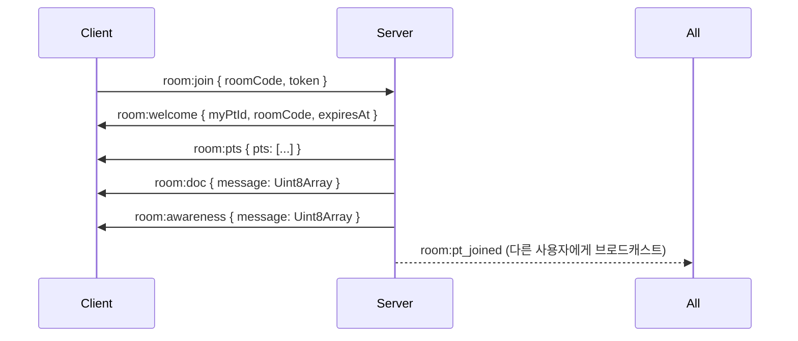
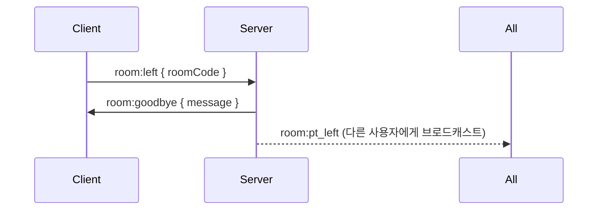
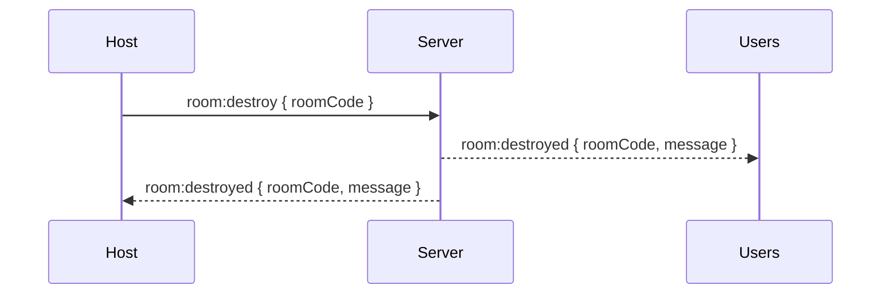

# 방 이벤트

방(Room) 생명주기 및 상태 관리를 위한 Socket 이벤트입니다.

:::info 이벤트 방향

- ⬆️ **C → S**: 클라이언트가 서버로 송신
- ⬇️ **S → C**: 서버가 클라이언트로 송신
  :::

---

## 1. room:join

⬆️ **Client → Server**

방에 입장 요청을 보냅니다.

### Payload

import Tabs from '@theme/Tabs';
import TabItem from '@theme/TabItem';

<Tabs>
  <TabItem value="schema" label="Schema" default>
    ```typescript
    {
      roomCode: string; // 입장할 방 코드
      token: string;    // API에서 받은 인증 토큰
    }
    ```
  </TabItem>
  <TabItem value="example" label="Example">
    ```json
    {
      "roomCode": "ABC123",
      "token": "eyJhbGciOiJIUzI1NiIsInR5cCI6IkpXVCJ9..."
    }
    ```
  </TabItem>
</Tabs>

### 사용 예시

```typescript
socket.emit('room:join', {
  roomCode: 'ABC123',
  token: authToken,
});
```

---

## 2. room:welcome

⬇️ **Server → Client**

입장한 사용자에게 자신의 참가자 정보를 전송합니다.

### Payload

<Tabs>
  <TabItem value="schema" label="Schema" default>
    ```typescript
    {
      myPtId: string;     // 자신의 참가자 ID (UUIDv7)
      roomCode: string;   // 방 코드
      expiresAt: string;  // 방 만료 시간 (ISO 8601)
    }
    ```
  </TabItem>
  <TabItem value="example" label="Example">
    ```json
    {
      "myPtId": "018e1234-5678-7abc-def0-123456789abc",
      "roomCode": "ABC123",
      "expiresAt": "2026-02-04T13:00:00.000Z"
    }
    ```
  </TabItem>
</Tabs>

### 사용 예시

```typescript
socket.on('room:welcome', (payload) => {
  console.log('내 참가자 ID:', payload.myPtId);
  console.log('방 만료 시간:', payload.expiresAt);

  // 상태 저장
  setMyParticipantId(payload.myPtId);
  setRoomExpiry(new Date(payload.expiresAt));
});
```

---

## 3. room:pts

⬇️ **Server → Client**

현재 방에 있는 모든 참가자 목록을 전송합니다.

### Payload

<Tabs>
  <TabItem value="schema" label="Schema" default>
    ```typescript
    {
      pts: Participant[]; // 참가자 목록
    }

    // Participant Schema
    {
      id: string;          // UUIDv7
      nickname: string;    // 닉네임
      role: 'host' | 'editor' | 'viewer'; // 권한
      color: string;       // 사용자 색상 (hex)
      isConnected: boolean; // 연결 상태
      createdAt: string;   // 생성 시간 (ISO 8601)
    }
    ```

  </TabItem>
  <TabItem value="example" label="Example">
    ```json
    {
      "pts": [
        {
          "id": "018e1234-5678-7abc-def0-123456789abc",
          "nickname": "Alice",
          "role": "host",
          "color": "#FF6B6B",
          "isConnected": true,
          "createdAt": "2026-02-04T12:00:00.000Z"
        },
        {
          "id": "018e1234-5678-7abc-def0-987654321xyz",
          "nickname": "Bob",
          "role": "editor",
          "color": "#4ECDC4",
          "isConnected": true,
          "createdAt": "2026-02-04T12:05:00.000Z"
        }
      ]
    }
    ```
  </TabItem>
</Tabs>

### 사용 예시

```typescript
socket.on('room:pts', (payload) => {
  const participants = payload.pts;
  console.log(`현재 참가자 수: ${participants.length}`);

  // 참가자 목록 업데이트
  setParticipants(participants);
});
```

---

## 4. room:doc

⬇️ **Server → Client**

Y.Doc의 초기 상태를 전송합니다 (CRDT 문서 동기화).

### Payload

<Tabs>
  <TabItem value="schema" label="Schema" default>
    ```typescript
    {
      message: Uint8Array; // Y.js 인코딩된 문서 상태
    }
    ```
  </TabItem>
  <TabItem value="example" label="Example">
    ```typescript
    // Binary data (Uint8Array)
    // Y.js가 자동으로 처리하므로 직접 다룰 필요 없음
    ```
  </TabItem>
</Tabs>

### 사용 예시

```typescript
import * as Y from 'yjs';

const ydoc = new Y.Doc();

socket.on('room:doc', (payload) => {
  // Y.Doc에 초기 상태 적용
  Y.applyUpdate(ydoc, new Uint8Array(payload.message));
  console.log('문서 초기 상태 로드 완료');
});
```

---

## 5. room:awareness

⬇️ **Server → Client**

Awareness의 초기 상태를 전송합니다 (커서 위치, 선택 영역 등).

### Payload

<Tabs>
  <TabItem value="schema" label="Schema" default>
    ```typescript
    {
      message: Uint8Array; // Awareness 인코딩된 상태
    }
    ```
  </TabItem>
</Tabs>

### 사용 예시

```typescript
import { Awareness } from 'y-protocols/awareness';

const awareness = new Awareness(ydoc);

socket.on('room:awareness', (payload) => {
  // Awareness에 초기 상태 적용
  awareness.applyUpdate(new Uint8Array(payload.message), 'remote');
  console.log('Awareness 초기 상태 로드 완료');
});
```

---

## 6. room:expired

⬇️ **Server → Client (Broadcast)**

방이 만료되었음을 모든 참가자에게 알립니다.

### Payload

<Tabs>
  <TabItem value="schema" label="Schema" default>
    ```typescript
    {
      roomCode: string; // 만료된 방 코드
    }
    ```
  </TabItem>
  <TabItem value="example" label="Example">
    ```json
    {
      "roomCode": "ABC123"
    }
    ```
  </TabItem>
</Tabs>

### 사용 예시

```typescript
socket.on('room:expired', (payload) => {
  alert(`방이 만료되었습니다: ${payload.roomCode}`);
  // 홈 화면으로 이동
  router.push('/');
});
```

---

## 7. room:left

⬆️ **Client → Server**

방에서 나가겠다는 의사를 서버에 전달합니다.

### Payload

<Tabs>
  <TabItem value="schema" label="Schema" default>
    ```typescript
    {
      roomCode: string; // 나갈 방 코드
    }
    ```
  </TabItem>
  <TabItem value="example" label="Example">
    ```json
    {
      "roomCode": "ABC123"
    }
    ```
  </TabItem>
</Tabs>

### 사용 예시

```typescript
const leaveRoom = () => {
  socket.emit('room:left', { roomCode });
};
```

---

## 8. room:goodbye

⬇️ **Server → Client**

퇴장 요청이 정상적으로 처리되었음을 확인합니다.

### Payload

<Tabs>
  <TabItem value="schema" label="Schema" default>
    ```typescript
    {
      message: string; // "방에서 나갔습니다."
    }
    ```
  </TabItem>
  <TabItem value="example" label="Example">
    ```json
    {
      "message": "방에서 나갔습니다."
    }
    ```
  </TabItem>
</Tabs>

### 사용 예시

```typescript
socket.on('room:goodbye', (payload) => {
  console.log(payload.message);
  // 정리 작업
  socket.disconnect();
  router.push('/');
});
```

---

## 9. room:destroy

⬆️ **Client → Server**

방을 폭파(삭제)합니다. **Host만 가능**합니다.

### Payload

<Tabs>
  <TabItem value="schema" label="Schema" default>
    ```typescript
    {
      roomCode: string; // 폭파할 방 코드
    }
    ```
  </TabItem>
  <TabItem value="example" label="Example">
    ```json
    {
      "roomCode": "ABC123"
    }
    ```
  </TabItem>
</Tabs>

### 권한

:::danger 권한 필요
이 이벤트는 **Host 권한**이 있는 사용자만 실행할 수 있습니다.
:::

### 사용 예시

```typescript
const destroyRoom = () => {
  if (myRole === 'host') {
    socket.emit('room:destroy', { roomCode });
  }
};
```

---

## 10. room:destroyed

⬇️ **Server → Client (Broadcast)**

방이 폭파되었음을 모든 참가자에게 알립니다.

### Payload

<Tabs>
  <TabItem value="schema" label="Schema" default>
    ```typescript
    {
      roomCode: string;  // 폭파된 방 코드
      message: string;   // "방이 폭파되었습니다."
    }
    ```
  </TabItem>
  <TabItem value="example" label="Example">
    ```json
    {
      "roomCode": "ABC123",
      "message": "방이 폭파되었습니다."
    }
    ```
  </TabItem>
</Tabs>

### 사용 예시

```typescript
socket.on('room:destroyed', (payload) => {
  alert(payload.message);
  // 강제 퇴장
  socket.disconnect();
  router.push('/');
});
```

---

## 이벤트 흐름

### 방 입장 시퀀스



### 방 퇴장 시퀀스



### 방 폭파 시퀀스



---

## 오류 처리

모든 이벤트에서 오류 발생 시 다음과 같은 형식으로 응답됩니다:

```typescript
socket.on('error', (error) => {
  console.error('Socket error:', error);
  // { message: string, code?: string }
});
```

### 일반 오류 사례

- **인증 실패**: 유효하지 않은 토큰
- **권한 부족**: Host 전용 기능 실행 시도
- **방 없음**: 존재하지 않는 roomCode
- **중복 연결**: 동일 사용자의 중복 접속 시도
