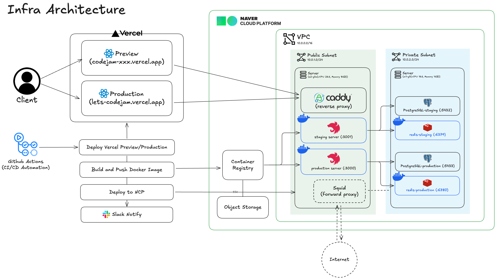

CodeJam 프로젝트는 **Vercel**의 강력한 프론트엔드 배포 편의성과 **Naver Cloud Platform (NCP)** 의 안정적인 백엔드 환경을 결합한 하이브리드 클라우드 아키텍처를 사용합니다.

## 🏗️ 아키텍처 개요

Frontend는 Vercel CDN을 통해 전 세계에 빠르게 서빙되며, Backend는 NCP VPC 내의 격리된 환경에서 Docker 컨테이너로 운영됩니다.

<!-- truncate -->

---

## 🧩 주요 구성 요소

### 1. Client Layer (Vercel)

- **Preview 환경**: `codejam-*.vercel.app` (PR 생성 시 자동 배포)
- **Production 환경**: `lets-codejam.vercel.app` (Main 브랜치)
- GitHub Actions와 연동되어 코드 변경 시 즉시 빌드 및 배포됩니다.

### 2. VPC (Naver Cloud Platform)

보안을 위해 **Public Subnet**과 **Private Subnet**으로 네트워크를 격리했습니다.

- **Public Subnet**:
  - **Caddy**: Reverse Proxy 역할을 하며 SSL 인증서(ZeroSSL)를 자동으로 관리합니다. 요청을 받아 Staging 또는 Production 서버로 라우팅합니다.
  - **Application Servers**: Docker 컨테이너 기반의 NestJS 서버가 구동됩니다.
- **Private Subnet**:
  - **Redis**: Y-Redis 기반의 실시간 문서 동기화 데이터를 저장합니다 (AOF 설정으로 데이터 보존).
  - **PostgreSQL**: 방 정보, 사용자 메타데이터 등 영구 데이터를 보관합니다.

### 3. CI/CD 파이프라인

GitHub Actions를 통해 개발 단계별로 자동화된 배포 프로세스를 구축했습니다.

| 브랜치        | 환경       | Client URL                   | Server URL                  |
| :------------ | :--------- | :--------------------------- | :-------------------------- |
| **PR to dev** | Preview    | `codejam-xxx.vercel.app`     | `staging.codejam.kro.kr`    |
| **dev**       | Staging    | `codejam-staging.vercel.app` | `staging.codejam.kro.kr`    |
| **main**      | Production | `lets-codejam.vercel.app`    | `production.codejam.kro.kr` |

---

## 🛡️ 보안 및 최적화

- **네트워크 격리**: DB와 Redis는 외부에서 직접 접근할 수 없도록 Private Subnet에 배치했습니다.
- **SSL/TLS**: Caddy를 통해 모든 통신에 HTTPS를 강제 적용했습니다.
- **비용 최적화**: Vercel Hobby Plan과 NCP의 Micro 서버를 적절히 혼합하여 비용 효율성을 극대화했습니다.
- **Preview Cleanup**: PR이 닫히면 Vercel의 Preview 배포를 자동으로 삭제하여 리소스 낭비를 방지합니다.

앞으로는 Prometheus와 Grafana를 도입하여 모니터링을 강화하고, 무중단 배포(Blue-Green) 전략을 도입할 계획입니다.
