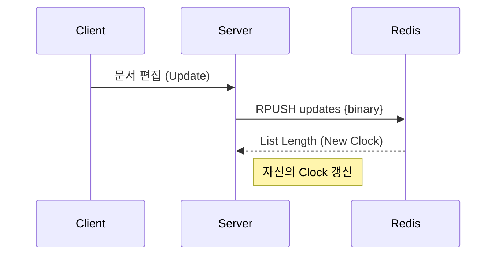
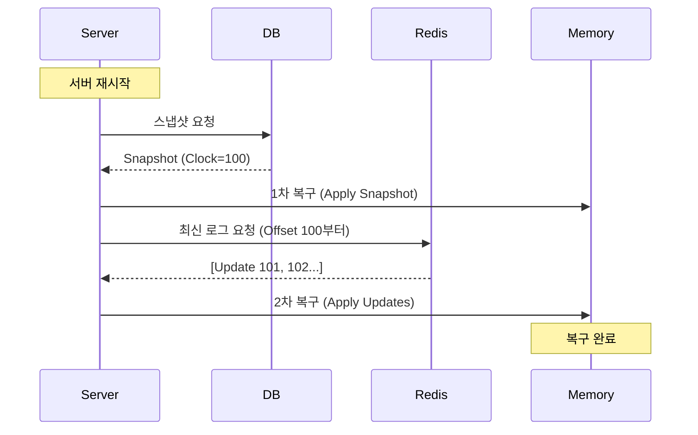

CodeJam 서비스 개발 중 겪었던 **서버 재시작 시 문서 데이터 유실 문제**와 이를 해결하기 위해 **Redis와 DB를 결합한 하이브리드 전략**을 도입한 과정을 공유합니다.

## 1. 문제 상황

CodeJam은 실시간 동시 편집을 위해 메모리 상에서 `Y.Doc`을 관리합니다. 하지만 배포나 장애로 인해 서버가 재시작되면 메모리 데이터가 휘발되어 사용자의 문서가 유실되는 치명적인 문제가 있었습니다.

이를 해결하기 위해 다음과 같은 요구사항을 정의했습니다.

1.  **데이터 영속성**: 서버가 언제 꺼져도 데이터는 복구되어야 한다.
2.  **메모리 효율성**: Redis의 메모리 사용량을 무한정 늘릴 수 없다.
3.  **성능**: 실시간성을 해치지 않아야 한다.

---

## 2. 해결 전략: Redis + DB 하이브리드 구조

우리는 `Y-Redis`의 설계를 참고하여, **빠른 쓰기는 Redis**가 담당하고 **영구 저장은 DB**가 담당하는 구조를 설계했습니다.

### 2.1 Y-Redis 커스텀 구현

별도의 라이브러리 설치 없이 `Y-Redis`의 핵심 로직인 **List + Clock** 구조를 이식했습니다[cite: 23, 34].

- **Redis List**: 문서의 변경 사항(Update)을 순서대로 저장합니다.
- **Clock**: 각 서버는 자신이 어디까지 데이터를 읽었는지(Index)를 `clock` 변수로 관리하여, 전체 데이터를 매번 조회하지 않고 필요한 부분만 가져옵니다(`O(N)` 방지).

---

## 3. 메모리 최적화: Snapshot & Compact

Redis에 모든 수정 내역을 계속 쌓으면 메모리가 금방 부족해집니다. 특히 CRDT 데이터 특성상 글자 하나에도 메타데이터가 포함되어 용량이 큽니다.

이를 해결하기 위해 **Write-Back Cache** 패턴을 적용했습니다.

1.  **Snapshot**: 일정 주기마다 현재 문서 상태를 DB에 저장합니다.

2.  **Compact**: DB 저장이 완료되면, Redis에 있는 오래된 내역을 삭제하여 메모리를 확보합니다.

3.  **Offset**: 데이터가 삭제되어 인덱스가 밀리는 문제를 해결하기 위해 `Offset` 변수를 도입하여 물리적 인덱스를 보정했습니다.

> **Physical Index = Clock - Offset**

---

## 4. 최종 복구 프로세스 (Hydration)

서버가 재시작되면 다음과 같은 순서로 문서를 복구(Hydration)합니다.

1. **DB 조회**: 가장 최근에 저장된 `Snapshot`을 불러와 `Y.Doc`을 1차 복구합니다.
2. **Redis 조회**: 스냅샷 저장 이후에 발생한 최신 변경 사항(`LRANGE`)을 가져옵니다.
3. **병합**: 두 데이터를 합쳐 완벽한 최신 상태를 만듭니다.

---

## 5. 마치며

이 전략을 통해 실시간 협업의 **성능**과 데이터의 **안정성**이라는 두 마리 토끼를 잡을 수 있었습니다. 추후에는 `Redis Streams`를 도입하여 동시성 처리를 더 고도화할 계획입니다.
