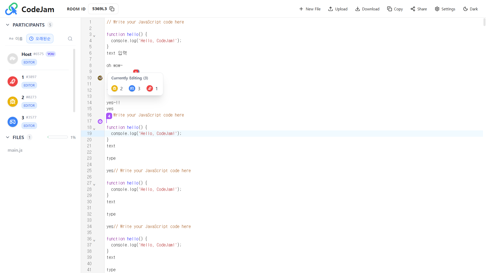

실시간 협업 에디터에서 가장 중요한 경험 중 하나는 **"내 동료가 지금 어디를 보고, 무엇을 수정하고 있는가"** 를 느끼게 해주는 것입니다.

이번 글에서는 **Yjs Awareness**를 활용하여 실시간 커서와 라인 아바타를 구현한 과정, 그리고 비대해진 `CodeEditor` 컴포넌트를 **Compartment 패턴**으로 리팩토링하여 유지보수성을 높인 경험을 공유합니다.

## 1. Awareness: 실시간 존재감의 시각화

단순히 텍스트만 동기화되는 것이 아니라, 사용자의 커서 위치와 선택 영역(Selection)을 실시간으로 보여주기 위해 **Yjs Awareness** 프로토콜을 사용했습니다.

<!-- truncate -->

### 🔄 Awareness 동기화 브릿지 (`useAwarenessSync`)

Yjs의 상태와 React의 로컬 상태(`useRoomStore`, `useFileStore`)를 연결하는 단방향 동기화 브릿지를 구현했습니다.

- **Yjs -> Local**: 다른 사용자의 커서 움직임이나 상태 변경이 발생하면, 이를 감지하여 리액트 컴포넌트가 렌더링될 수 있도록 상태를 업데이트합니다.
- **Local -> Yjs**: 나의 커서 이동이나 파일 변경 등의 액션을 Yjs Awareness에 전파합니다.

이를 통해 **참여자 목록**에서의 상태 표시와 **에디터 내부**의 커서/아바타 표시를 일관성 있게 유지할 수 있었습니다.



---

## 2. CodeEditor 리팩토링: Monolith에서 Modular로

개발 초기에는 하나의 `CodeEditor` 컴포넌트에 모든 기능(테마, 키맵, 데이터 바인딩 등)을 몰아넣다 보니, 코드가 비대해지고 설정 변경이 어려웠습니다.

### 🧩 Compartment 패턴 도입

**CodeMirror 6**의 강력한 기능인 `Compartment`를 도입하여, 에디터의 각 기능을 독립적인 **Compartment**로 분리했습니다.

- **설정의 동적 변경**: 재렌더링 없이도 특정 구획(예: `ReadOnly` 모드, `Theme` 설정)만 효율적으로 갈아끼울 수 있게 되었습니다.
- **관심사 분리**:
  - `EditorSetup`: 기본 에디터 설정
  - `KeymapConfig`: 단축키 바인딩
  - `ThemeConfig`: 다크모드/라이트모드 테마
  - `CollaborationExtension`: Yjs 협업 로직

```typescript
// 예시 코드: Compartment를 이용한 동적 설정 재구성
const readOnlyCompartment = new Compartment();
const themeCompartment = new Compartment();

// 상태가 바뀔 때 전체를 다시 그리는 게 아니라, 해당 Compartment만 업데이트
view.dispatch({
  effects: readOnlyCompartment.reconfigure(EditorView.editable.of(!isReadOnly)),
});
```
