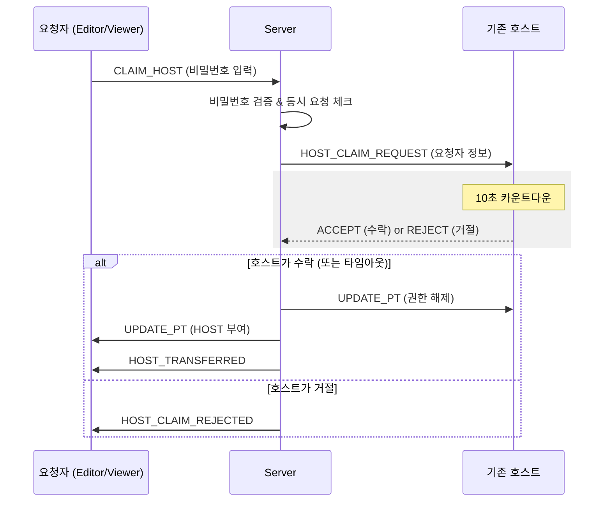

CodeJam의 **Custom Room**은 강의나 발표 상황을 가정하여 강력한 제어권을 가진 'Host'가 존재합니다. 만약 Host가 접속을 끊거나 부재중일 때, 다른 관리자가 권한을 이어받을 수 있도록 **호스트 권한 탈취(Claim Host)** 기능을 설계했습니다.

## 💡 개요

- **목표**: `hostPassword`를 아는 참가자가 호스트 권한을 요청하고, 기존 호스트가 이를 수락하거나 거절하는 프로세스 구현.
- **제약 사항**: Quick Room(호스트 없음)이나 비밀번호가 설정되지 않은 방에서는 동작하지 않습니다.

<!-- truncate -->

---

## 🔄 핵심 흐름 (Core Flow)

참가자가 권한을 요청하면 즉시 권한이 넘어가는 것이 아니라, **기존 호스트의 승인**을 거치거나 **타임아웃(10초)** 후에 처리됩니다.

---

## 🏗️ 계층별 설계

안정적인 처리를 위해 3계층 아키텍처로 역할을 분리했습니다.

1. **Guard Layer (권한 필터)**

- `CustomRoomGuard`: Custom Room인지 확인 (DB 조회 없이 소켓 데이터로 판단)
- `NotHostGuard`: 이미 호스트인 사람이 요청하는 것을 방지

2. **Service Layer (비즈니스 로직)**

- `hostPassword` 검증
- **동시성 제어**: `pendingClaims` Map을 사용하여 한 방에서 동시에 여러 명이 권한을 요청하지 못하도록 막습니다.
- **타임아웃 관리**: 10초 내 응답이 없으면 자동으로 수락 처리하는 타이머를 관리합니다.

3. **Data Layer (상태 관리)**

- 실제 참여자(Participant)의 Role을 `HOST` ↔ `EDITOR/VIEWER`로 스위칭하고 저장합니다.

---

## ⚠️ 예외 상황 처리 (Edge Cases)

설계 과정에서 가장 고민했던 부분은 **"요청 중 상태 변경"** 이었습니다.

- **요청자가 대기 중 퇴장(Disconnect)**:
- 소켓 연결이 끊기면 서버는 `pendingClaims`를 확인합니다.
- 나간 사람이 요청자라면 즉시 타이머를 멈추고, 호스트에게 `HOST_CLAIM_CANCELLED` 이벤트를 보냅니다.

- **호스트가 없는 상황**:
- 방에 호스트가 없을 때 요청하면 에러를 반환하지 않고, **즉시 자동 수락**되도록 개선할 예정입니다.

이 기능을 통해 대규모 인원이 참여하는 세미나나 수업에서도 유연하고 안정적인 방 운영이 가능해질 것입니다.
