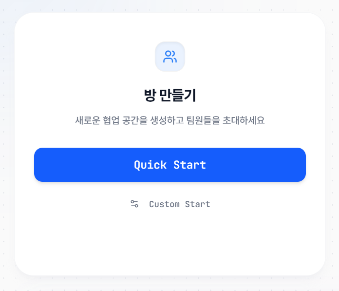
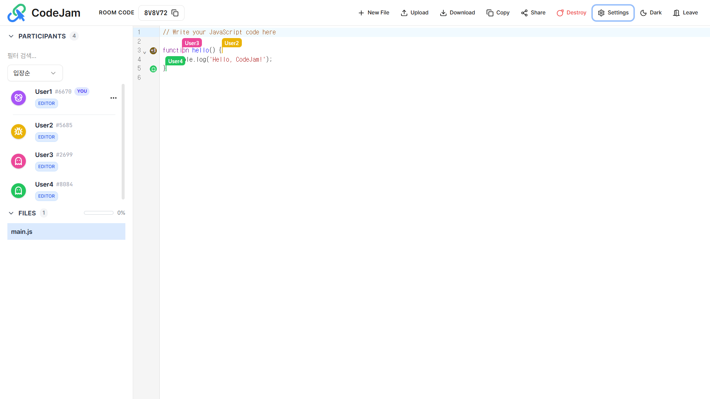
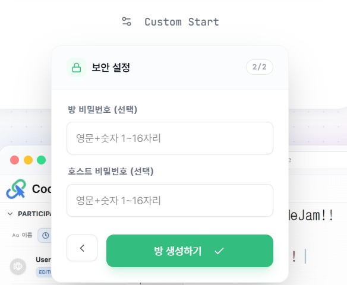
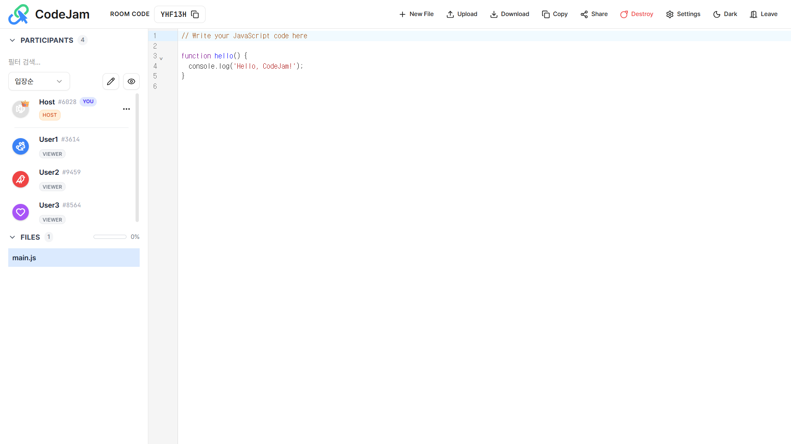

import Tabs from '@theme/Tabs';
import TabItem from '@theme/TabItem';

# 🏠 방 만들기

CodeJam 메인 화면에서 상황에 맞는 협업 모드를 선택하여 시작할 수 있습니다.

---

## 모드 선택 가이드

<Tabs>
  <TabItem value="quick" label="⚡ Quick Start (빠른 시작)" default>

### "가볍고 빠른 소규모 협업"

설정 없이 클릭 한 번으로 즉시 방을 생성합니다. 모든 참여자가 동등한 위치에서 코드를 작성하는 환경입니다.

#### 1. 주요 특징

- **최대 6명** 입장 제한 (소규모 최적화)
- **비밀번호 없음**: 링크만 있으면 누구나 입장
- **수평적 구조**: 방장(Host)이 없으며, 모두가 **Editor** 권한을 가짐

#### 2. 실제 화면 구성

방 생성 시 **모든 참여자가 Editor** 태그를 달고 있으며, 방장 아이콘(👑)이 없는 것을 확인할 수 있습니다.

> **추천:** 페어 프로그래밍, 알고리즘 스터디, 즉석 코드 리뷰

  </TabItem>
  <TabItem value="custom" label="🛠️ Custom Start (상세 설정)">

### "관리자가 필요한 대규모 세션"

인원수와 보안 설정을 마친 후 방을 생성합니다. 방장이 권한을 통제하는 환경입니다.

#### 1. 생성 단계 (Step-by-Step)

**Step 1: 인원 설정**
최소 2명부터 **최대 150명**까지 인원을 조절할 수 있습니다.

**Step 2: 보안 설정**
입장 비밀번호와 호스트(관리자) 비밀번호를 각각 설정할 수 있습니다.

#### 2. 실제 화면 구성

방 생성자에게는 **Host(👑)** 태그가 붙으며, 설정(Settings) 메뉴에 접근할 수 있습니다. 참여자는 **Viewer**로 입장하게 됩니다.

> **추천:** 대학 강의, 코딩 테스트 감독, 기술 세미나

  </TabItem>
</Tabs>

---

## 📊 한눈에 비교하기

| 구분           | Quick Start ⚡ | Custom Start 🛠️             |
| :------------- | :------------- | :-------------------------- |
| **최대 인원**  | 6명            | 150명                       |
| **방장(Host)** | ❌ (없음)      | ⭕ (생성자)                 |
| **기본 권한**  | 전원 Editor    | 생성자 Host / 참여자 Viewer |
| **비밀번호**   | 설정 불가      | 설정 가능                   |
| **용도**       | 자유로운 협업  | 통제된 강의/발표            |

:::tip 권한은 변경할 수 있나요?
**Custom Start**로 방을 만들었더라도, 호스트는 참여자 목록에서 특정 사용자의 권한을 `Viewer` ↔ `Editor`로 언제든지 변경할 수 있습니다.
:::
