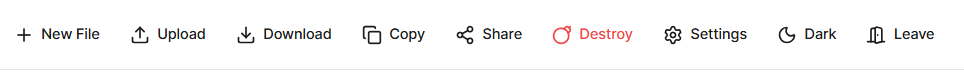
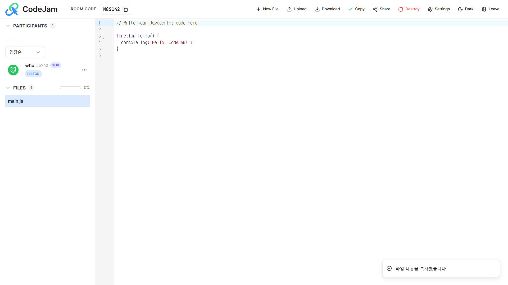
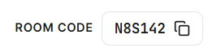
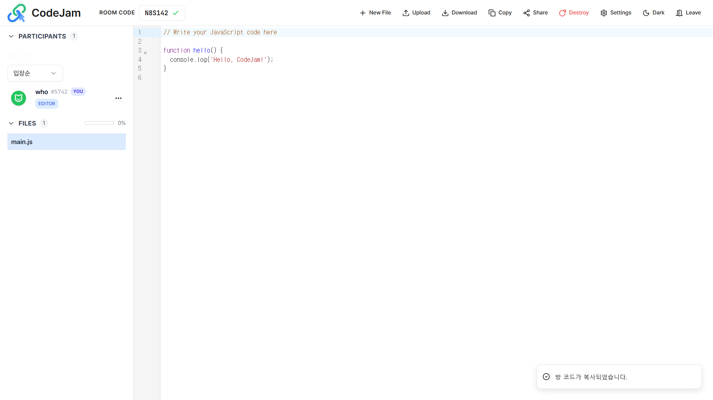
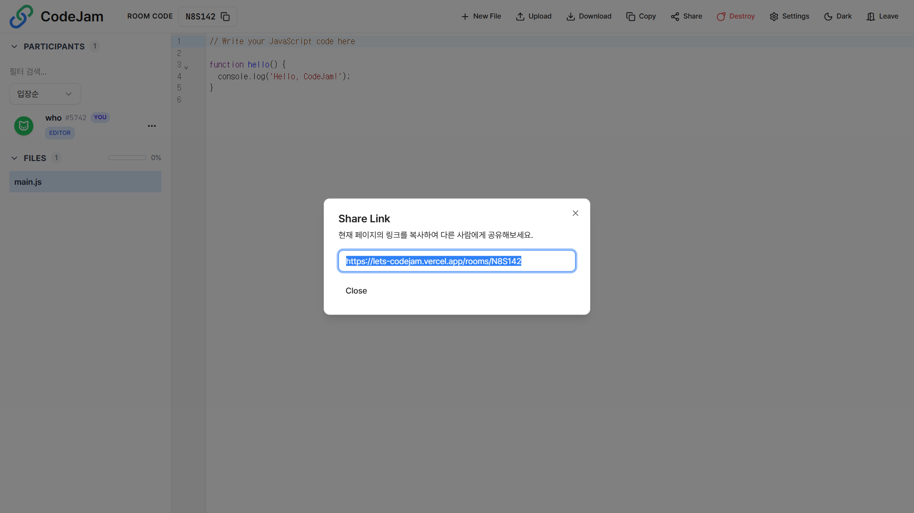
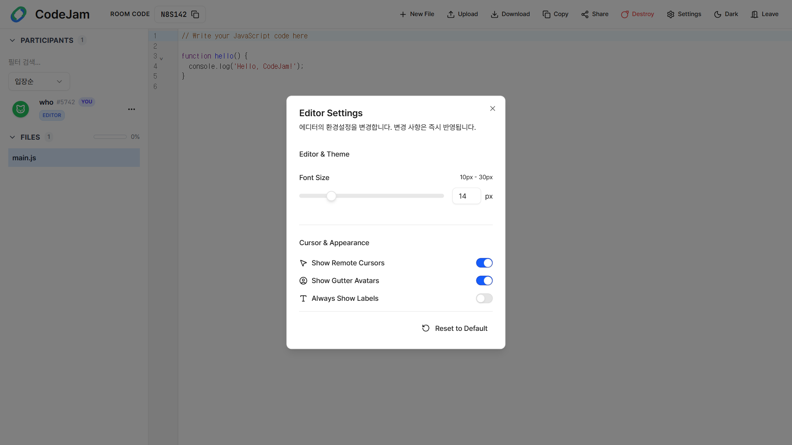
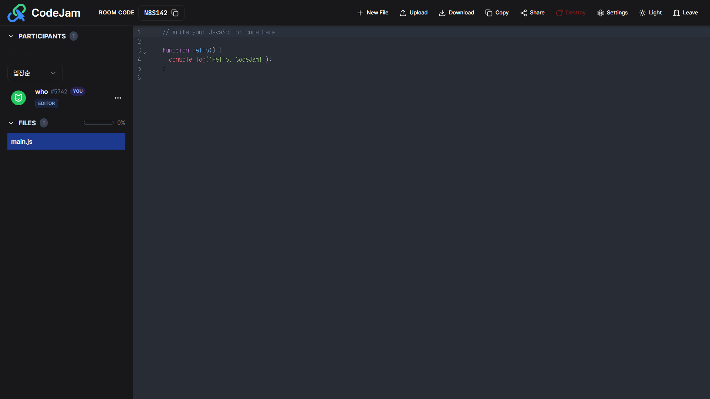
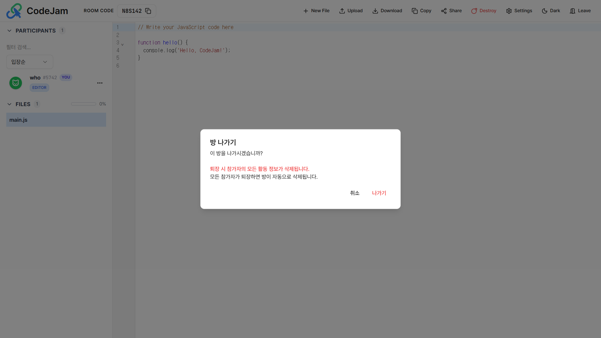
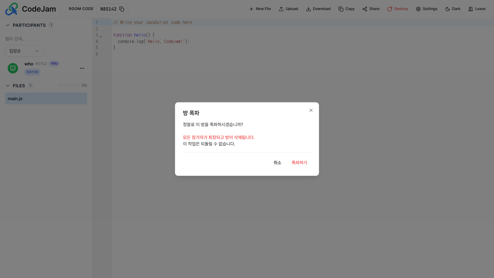

# 🛠️ 에디터 기능 가이드

CodeJam의 상단 헤더에는 협업을 효율적으로 돕는 다양한 유틸리티 도구들이 배치되어 있습니다.

---

## 📂 파일 및 코드 관리

코드를 작성하고 관리하는 기본적인 기능들입니다.

### 새 파일 만들기 (New File)

새로운 파일을 생성하여 탭으로 관리할 수 있습니다.
`+ New File` 버튼을 클릭하고 파일명과 확장자를 입력하세요.

### 코드 복사 (Copy)

현재 보고 있는 파일의 전체 코드를 클립보드에 즉시 복사합니다.

### 업로드 & 다운로드

- **Upload**: 내 컴퓨터에 있는 소스 코드를 불러옵니다.
- **Download**: 현재 작업 중인 파일들을 내 컴퓨터로 저장합니다.

---

## 🔗 초대 및 공유

팀원을 방으로 초대하는 방법입니다.

### 룸 코드 공유 (Room Code)

좌측 상단의 룸 코드를 클릭하면 코드가 클립보드에 복사됩니다. 이미 CodeJam에 접속해 있는 팀원에게 알려줄 때 유용합니다.

### 링크 공유 (Share)

`Share` 버튼을 누르면 접속 링크 전체가 생성됩니다. 이 링크를 전달하면 팀원은 별도의 코드 입력 없이 바로 방으로 연결됩니다.

---

## ⚙️ 환경 설정 (Settings)

개인의 코딩 스타일에 맞춰 에디터 환경을 커스터마이징할 수 있습니다.

### 에디터 설정

`Settings` 버튼을 눌러 글자 크기와 협업 시각화 옵션을 조정할 수 있습니다.

- **Font Size**: 폰트 크기를 10px ~ 30px 사이로 조절합니다.
- **Show Remote Cursors**: 다른 사람의 커서 위치를 실시간으로 보여줍니다.
- **Show Gutter Avatars**: 라인 번호 옆에 현재 해당 라인을 수정 중인 사람의 아바타를 표시합니다.
- **Always Show Labels**: 커서 옆에 항상 닉네임 라벨을 표시할지 선택합니다.

### 다크 모드 (Dark Mode)

장시간 코딩으로 눈이 피로하다면 `Dark` 버튼을 눌러 테마를 변경해 보세요.

---

## 🚪 방 나가기 및 삭제

### 방 나가기 (Leave)

현재 세션에서 퇴장합니다. 내가 작성하던 코드는 방에 그대로 남아있으며, 다른 팀원들은 계속 작업을 이어갈 수 있습니다.

### 방 폭파 (Destroy)

:::danger 호스트 전용 기능
이 기능은 **Host(방장)** 권한을 가진 사용자만 사용할 수 있습니다.
:::

`Destroy` 버튼은 방을 완전히 삭제하는 기능입니다.
버튼을 누르면 **모든 참가자가 즉시 퇴장**당하며, 작성된 모든 코드와 데이터는 **영구적으로 삭제**되어 복구할 수 없습니다.

