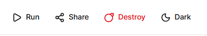
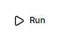
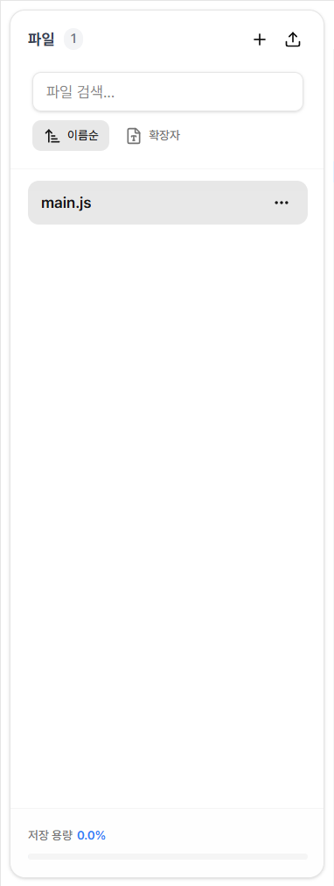
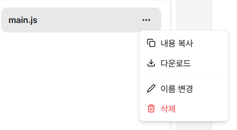
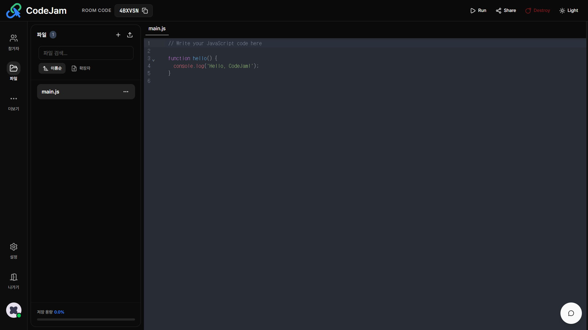
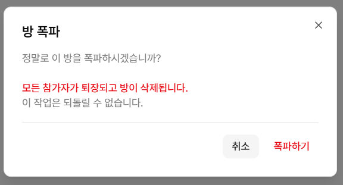

# 🛠️ 에디터 기능 가이드

CodeJam 워크스페이스 상단과 좌측에는 협업을 돕는 다양한 도구들이 배치되어 있습니다.

---

## ✉️ 초대 및 공유

팀원을 방으로 초대하는 방법입니다.

### 룸 코드 (Room Code)

파일 패널 상단의 **+** 버튼을 클릭하여 새 파일을 생성합니다.

**지원 확장자:**

- `.js` - JavaScript
- `.py` - Python
- `.c`, `.cpp` - C/C++
- `.java` - Java
- `.ts` - TypeScript
- `.html` - HTML
- `.css` - CSS

---

## ▶️ 코드 실행

작성한 코드를 서버에서 즉시 실행하고 결과를 확인합니다.

### 실행 방법

1. 실행할 코드가 작성된 파일을 선택합니다.
2. 헤더 우측의 **▶️ Run** 버튼을 클릭하거나 단축키를 사용합니다.
   - **Windows/Linux**: `Ctrl + Enter`
   - **Mac**: `Cmd + Enter`
3. 우측 **Output** 패널에서 실행 결과를 확인합니다.

### 지원 언어 및 버전

- **JavaScript** (Node.js 20.11.1)
- **TypeScript** (5.0.3)
- **Python** (3.10.0)
- **C/C++** (gcc 10.2.0)
- **Java** (15.0.2)

### 실행 제한

- **권한**: Editor 이상 권한 필요
- **Rate Limiting**: 1분에 10회까지
- **타임아웃**: 컴파일 10초, 실행 3초

### 출력 콘솔

우측 콘솔 패널에서 실행 결과를 확인할 수 있습니다:

- **표준 출력 (stdout)**: 일반 텍스트
- **표준 에러 (stderr)**: 빨간색 텍스트
- **실행 시간 및 종료 코드** 표시

**패널 제어:**

- 🗑️ **지우기**: 모든 출력 내용 삭제
- 📋 **복사**: 출력 내용 클립보드에 복사
- **크기 조절**: 좌측 경계선 드래그로 너비 조절

---

## 📂 파일 관리

좌측 사이드바의 **파일(📁)** 아이콘을 클릭하여 관리 패널을 엽니다.

### 새 파일 만들기 (New File)

좌측 사이드바의 파일 탭에서 새로운 파일을 생성하여 관리할 수 있습니다.
`+` 버튼을 클릭하고 파일명과 확장자를 입력하세요.

**지원 확장자:**

- `.js` - JavaScript
- `.py` - Python
- `.c`, `.cpp` - C/C++
- `.java` - Java
- `.ts` - TypeScript
- `.html` - HTML
- `.css` - CSS

### 파일 드래그 앤 드롭

로컬 파일을 에디터 영역으로 드래그하여 빠르게 업로드할 수 있습니다.

1. 로컬 파일을 에디터 영역으로 드래그
2. 파일 내용이 자동으로 새 파일로 생성
3. 파일명은 원본 파일명 사용

**제한사항:**

- 한 번에 하나씩만 업로드 가능
- 텍스트 파일만 지원

### 파일 옵션 메뉴

의 **⋯** 버튼을 클릭하면 다양한 작업을 수행할 수 있습니다:

- **내용 복사**: 파일 전체 내용을 클립보드에 복사
- **다운로드**: 로컬로 파일 다운로드
- **이름 변경**: 파일명 수정 (확장자 변경 불가)
- **삭제**: 파일 영구 삭제

---

## ⚙️ 에디터 설정 및 프로필

좌측 사이드바 하단에서 다양한 설정과 기능에 접근할 수 있습니다:

- **설정 (Settings)**: 폰트 크기, 커서 표시, 코드 실행 등 에디터 환경 설정 ([설정 가이드](./settings-guide.md) 참고)
- **나가기 (Leave)**: 현재 방에서 퇴장
- **프로필**: 닉네임 변경 및 개인 정보 확인

자세한 설정 방법은 [설정 가이드](./settings-guide.md)를 참고하세요.

---

## 🌟 테마

헤더 최우측의 아이콘을 통해 테마를 변경할 수 있습니다.

- **🌙** 클릭 시 다크 모드로 전환됩니다.
- **☀️** 클릭 시 라이트 모드로 전환됩니다.

선택한 테마는 브라우저에 자동 저장되어 다음 접속 시에도 유지됩니다.

---

:::danger 호스트 전용 기능
이 기능은 **Host(방장)** 권한을 가진 사용자만 사용할 수 있습니다.
:::

헤더 우측의 **Destroy** 버튼은 방을 완전히 삭제하는 기능입니다.

버튼을 클릭하면:

- **모든 참가자가 즉시 퇴장**당합니다.
- 작성된 **모든 코드와 데이터가 영구적으로 삭제**되어 복구할 수 없습니다.

:::tip 일반 참가자는?
일반 참가자가 방을 나가려면 좌측 사이드바 하단의 **🚪 나가기(Leave)** 버튼을 사용하세요.  
나간 후에도 다른 참가자들은 계속 작업을 이어갈 수 있습니다.
:::

---

## 🔗 관련 가이드

- [워크스페이스 구조 이해하기](./workspace-layout.md)
- [설정 커스터마이징](./settings-guide.md)
- [채팅으로 소통하기](./chat-guide.md)
- [권한 관리 (Host 전용)](./role-management.md)
