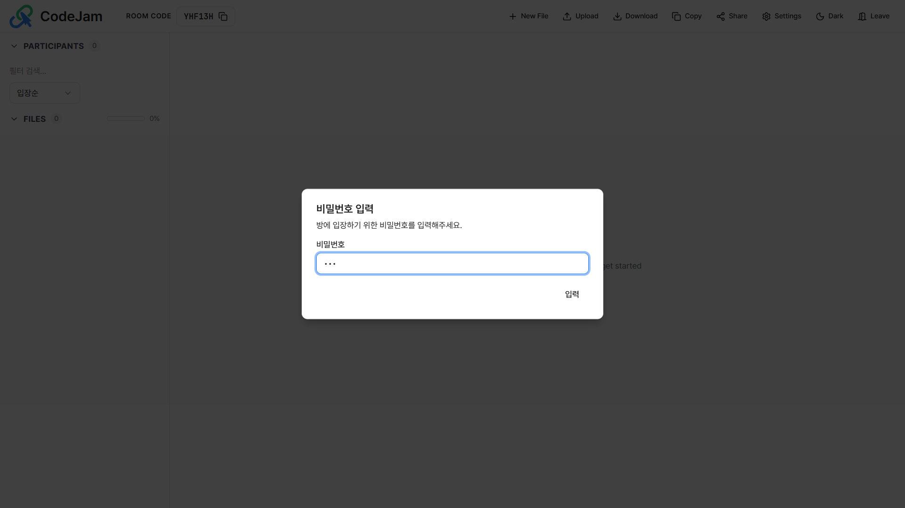
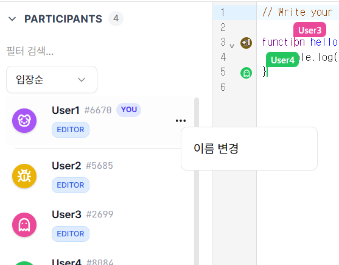
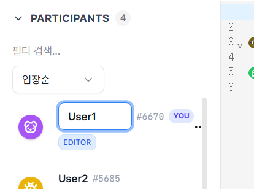

# 🚪 입장 및 프로필 설정

공유받은 링크로 접속했을 때의 입장 절차와 프로필 설정 방법입니다.

## 1. 방 입장하기

CodeJam 방에 입장하는 순서는 다음과 같습니다.

### Step 1: 비밀번호 입력 (Custom Room)

**Custom Start**로 생성된 비공개 방이라면, 보안을 위해 비밀번호 입력창이 가장 먼저 나타납니다.
_(비밀번호가 없는 Quick Start 방이나 공개 방은 이 단계가 생략됩니다.)_

### Step 2: 닉네임 설정

비밀번호 인증을 통과하면(또는 공개 방일 경우), 사용할 닉네임을 설정하는 화면이 나타납니다.

- **닉네임**: 1~6자리의 이름을 입력하고 `입장하기` 버튼을 누르면 협업 공간으로 이동합니다.

---

## 2. 닉네임 변경하기

입장 후에도 언제든지 나의 닉네임을 변경할 수 있습니다.

1.  좌측 참여자 목록(PARTICIPANTS)에서 **나(YOU)** 의 카드 우측 메뉴(`...`)를 클릭하거나 이름을 클릭합니다.
2.  입력창이 활성화되면 새로운 닉네임을 입력하고 `Enter`를 누르거나 빈 공간을 클릭합니다.

