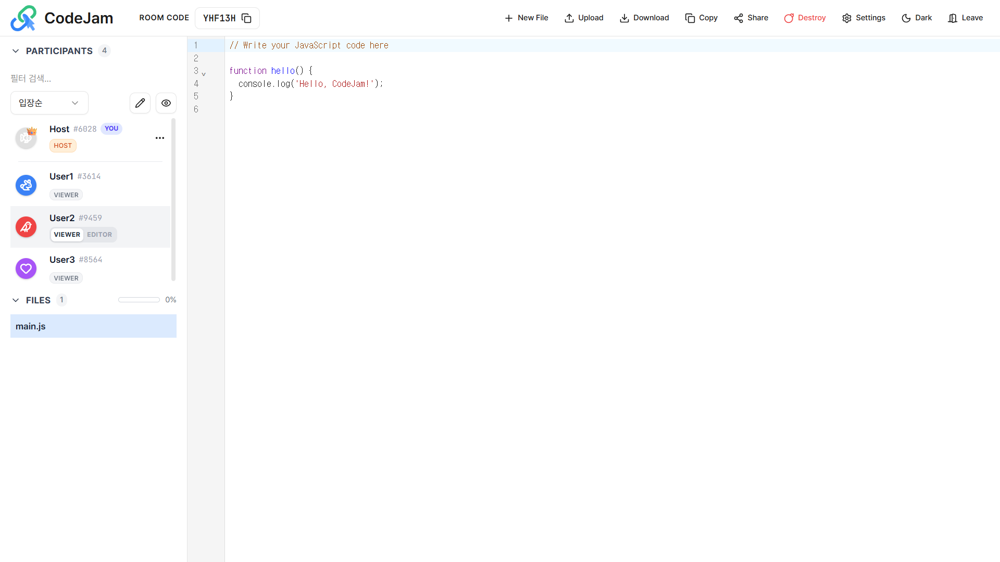
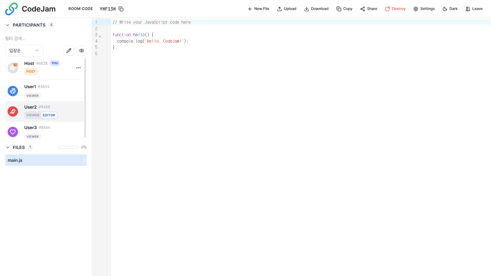
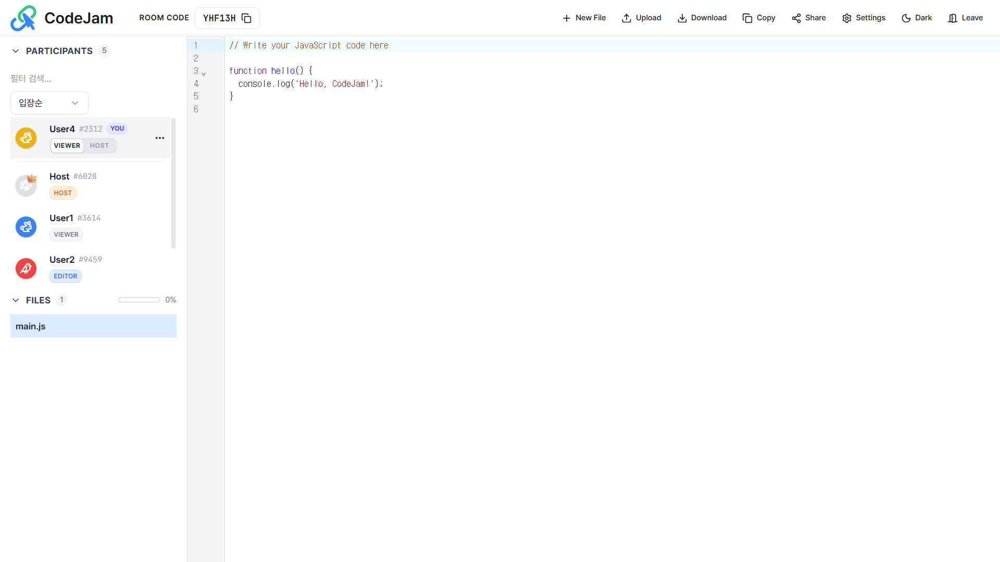
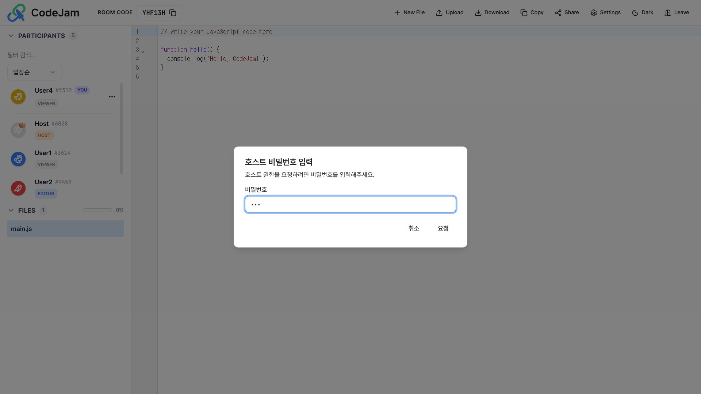
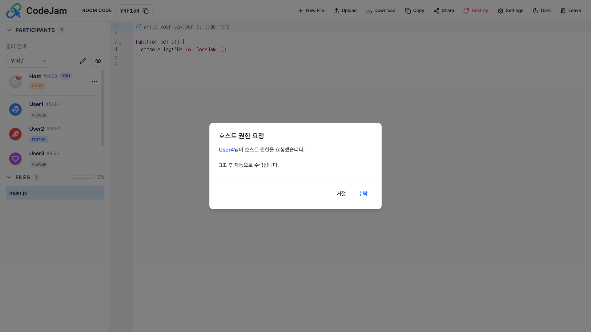
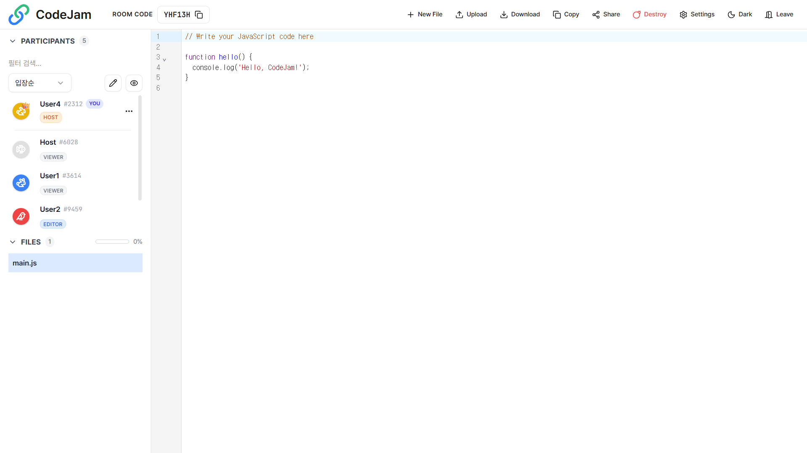

# 👑 권한 관리

:::warning 기능 제한
이 페이지의 기능은 **Custom Start** 모드에서만 사용할 수 있습니다.
Quick Start 모드는 모든 참여자가 Editor 권한을 가지므로 해당되지 않습니다.
:::

## 1. 에디터(Editor) 권한 부여

기본적으로 참여자는 **Viewer(관전자)** 권한으로 입장합니다. 방장(Host)은 특정 인원에게 코드를 수정할 수 있는 권한을 줄 수 있습니다.

1.  **Host**가 참여자 목록에서 권한을 변경할 유저를 찾습니다.
2.  `Viewer` 뱃지를 클릭하거나 메뉴에서 권한 변경을 선택합니다.
3.  해당 유저에게 **Editor** 권한이 부여되어 코드를 작성할 수 있게 됩니다.

---

## 2. 호스트(Host) 권한 위임하기

방을 만든 사람이 아니더라도, **호스트 비밀번호**를 알고 있다면 호스트 권한을 요청하여 가져올 수 있습니다.

### 호스트 권한 요청 프로세스

**1. 권한 요청 (참여자 화면)**
자신의 프로필 메뉴에서 `Host 권한 요청`을 클릭합니다. 방 생성 시 설정한 **호스트 비밀번호**를 입력해야 합니다.

**2. 수락 대기 (기존 호스트 화면)**
요청이 전송되면, 현재 호스트의 화면에 알림창이 뜹니다.

- **수락**: 즉시 권한이 넘어갑니다.
- **거절**: 요청이 취소됩니다.
- **자동 수락**: 10초 동안 응답이 없으면 **자동으로 수락**됩니다.

**3. 권한 교체 (Switch)**
수락이 완료되면 요청한 사람은 **Host**가 되고, 기존 호스트는 일반 참여자(Viewer/Editor)로 권한이 **서로 교체**됩니다.

