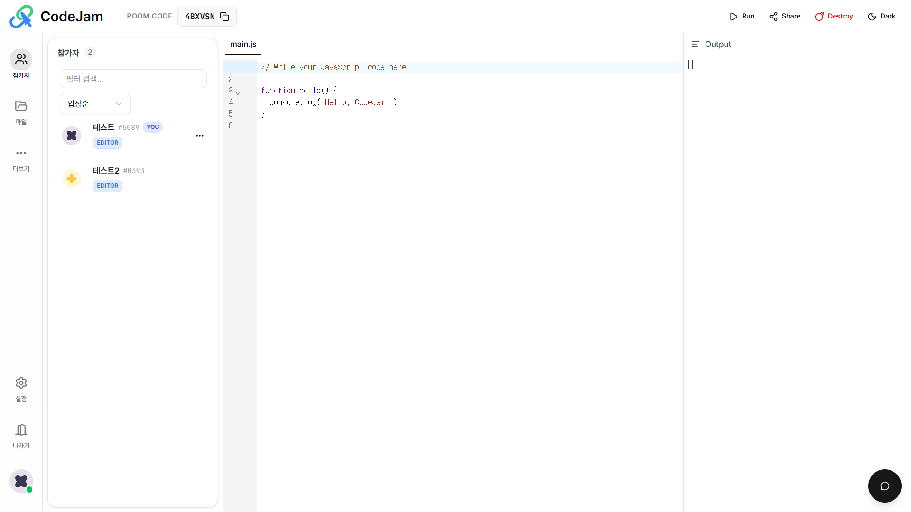
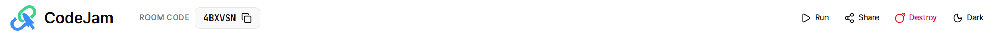
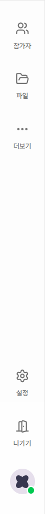
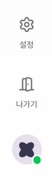
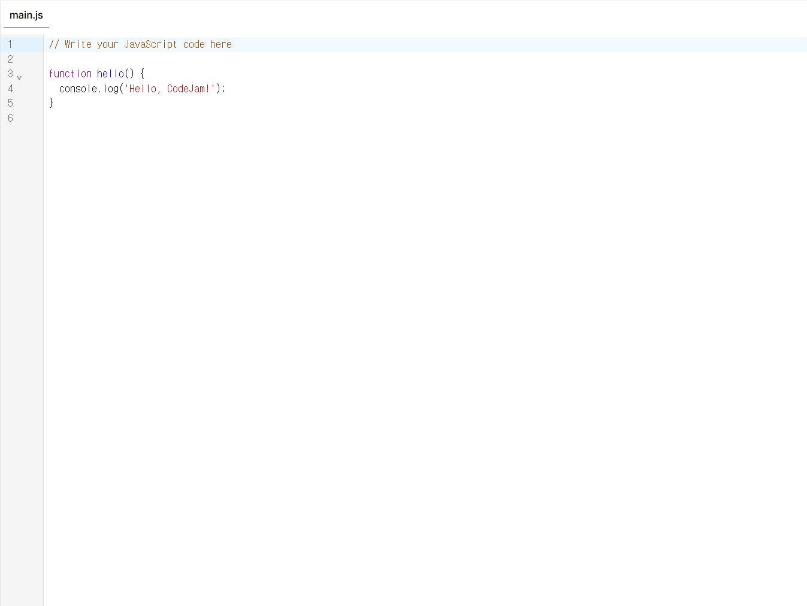
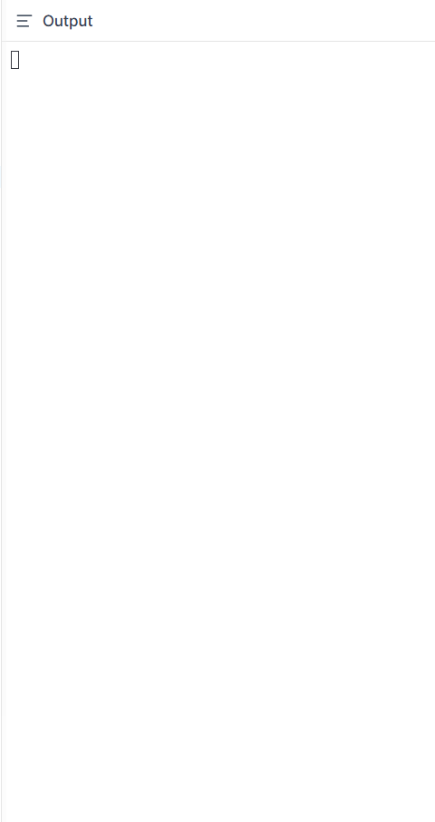

# 🖥️ 워크스페이스 구조

CodeJam의 인터페이스는 협업 효율을 극대화하기 위해 직관적으로 설계되었습니다. 각 영역의 명칭과 기능을 확인하세요.

---

## 전체 화면 구성

_**이미지**: 전체 UI 구성 (헤더, 사이드바, 에디터, 콘솔, 채팅)_

---

## 1️⃣ 상단 헤더 (Top Header)

방의 상태를 확인하고 주요 액션을 수행하는 공간입니다.

### 주요 구성 요소

- **CodeJam 로고**: 클릭 시 메인 페이지로 이동
- **Room Code**: 현재 접속 중인 방의 고유 코드입니다. 클릭하여 복사할 수 있습니다.
- **▶️ Run**: 현재 선택된 파일을 실행합니다. (Ctrl/Cmd + Enter)
- **🔗 Share**: 초대 링크 또는 QR 코드를 생성합니다.
- **🔥 Destroy**: (호스트 전용) 방을 완전히 삭제하고 모든 데이터를 파기합니다.
- **☀️/🌙 Theme**: 라이트 모드와 다크 모드를 전환합니다.

---

## 2️⃣ 좌측 사이드바 (Left Sidebar)

워크스페이스의 도구들을 전환하며 관리하는 공간입니다.

### 상단 탭 메뉴

- **👥 참가자 (Participants)**: 현재 접속 중인 사용자 목록과 권한을 확인합니다.
- **📁 파일 (Files)**: 파일을 생성, 삭제하거나 관리합니다.
- **⋯ 더보기 (More)**: 도움말, 버그 신고 등 추가 메뉴에 접근합니다.

### 하단 고정 메뉴

- **⚙️ 설정 (Settings)**: 폰트 크기, 커서 표시, 실시간 출력 등 에디터 환경을 설정합니다.
- **🚪 나가기 (Leave)**: 현재 방에서 퇴장합니다.
- **👤 프로필**: 닉네임 변경 및 개인 정보를 확인합니다.

:::tip
각 탭을 클릭하면 우측에 해당 패널이 펼쳐집니다. 동일한 탭을 다시 클릭하면 패널이 닫힙니다.
:::

---

## 3️⃣ 메인 에디터 (Main Editor)

실시간으로 코드를 작성하고 팀원과 협업하는 핵심 영역입니다.

### 협업 기능

- **멀티 커서**: 다른 사용자가 편집 중인 위치에 색상별 커서가 표시됩니다.
- **라인 아바타**: 에디터 좌측 여백에 현재 라인을 수정 중인 사용자의 아바타가 나타납니다.
- **Follow Mode**: 참가자 목록에서 아바타를 클릭하면 해당 사용자의 화면을 따라갑니다.

### 에디터 기능

- **파일 탭**: 상단 탭으로 여러 파일 간 전환이 가능합니다.
- **구문 강조**: JavaScript, Python, C/C++, Java 등 다양한 언어를 지원합니다.
- **자동 완성**: 기본적인 코드 자동 완성 기능을 제공합니다.

---

## 4️⃣ 출력 콘솔 (Output Console)

우측 패널은 코드 실행 결과가 표시되는 공간입니다.

### 주요 기능

- **표준 출력 (stdout)**: 일반 출력 내용이 표시됩니다.
- **표준 에러 (stderr)**: 에러 메시지가 빨간색으로 강조됩니다.
- **실행 정보**: 실행 시간과 종료 코드가 하단에 표시됩니다.

### 콘솔 제어

- **🗑️ 지우기**: 모든 출력 내용을 삭제합니다.
- **📋 복사**: 출력 내용을 클립보드에 복사합니다.
- **크기 조절**: 좌측 경계선을 드래그하여 패널 너비를 조절할 수 있습니다.

:::info
콘솔 패널은 코드 실행 시 자동으로 열리며, 우측 상단의 ✕ 버튼으로 닫을 수 있습니다.
:::

---

## 5️⃣ 실시간 채팅 (Chat)

우측 하단의 플로팅 버튼을 통해 팀원들과 대화할 수 있습니다.

### 채팅 기능

- **💬 플로팅 버튼**: 우측 하단에 고정된 원형 버튼입니다.
- **알림 뱃지**: 읽지 않은 메시지가 있으면 빨간색 숫자로 표시됩니다.
- **시스템 메시지**: 참가자 입장/퇴장, 권한 변경 등이 자동으로 표시됩니다.

자세한 사용법은 [채팅 가이드](./chat-guide.md)를 참고하세요.

---

## 🎯 화면 레이아웃 최적화 팁

### 소규모 협업 (2-4명)

- 사이드바를 펼쳐 참가자 상태를 항상 확인
- 콘솔 패널을 적당한 크기로 유지하여 에디터와 결과를 동시에 확인

### 대규모 세션 (강의/발표)

- 사이드바를 접어 에디터 영역 최대화
- Follow Mode를 활용하여 호스트의 화면을 추적

### 페어 프로그래밍

- 채팅보다는 음성 통화 병행 권장
- 설정에서 "원격 커서 표시"와 "라인 아바타" 활성화

---

## 📱 모바일 및 태블릿 지원

CodeJam은 태블릿과 모바일 브라우저에서도 작동하지만, 최적의 경험을 위해서는 **데스크톱 환경**을 권장합니다.

| 기기    | 권장 여부 | 제약 사항                |
| ------- | --------- | ------------------------ |
| Desktop | ⭕ 권장   | 모든 기능 완벽 지원      |
| Tablet  | △ 가능    | 터치 인터랙션 제한적     |
| Mobile  | ❌ 비권장 | 화면 크기로 인한 UX 제한 |

---

## 🔗 다음 단계

워크스페이스 구조를 이해했다면 이제 실제로 사용해보세요!

- [파일 관리 및 코드 실행](./editor-features.md)
- [설정 커스터마이징](./settings-guide.md)
- [권한 관리 (Host 전용)](./role-management.md)
- [채팅으로 소통하기](./chat-guide.md)
